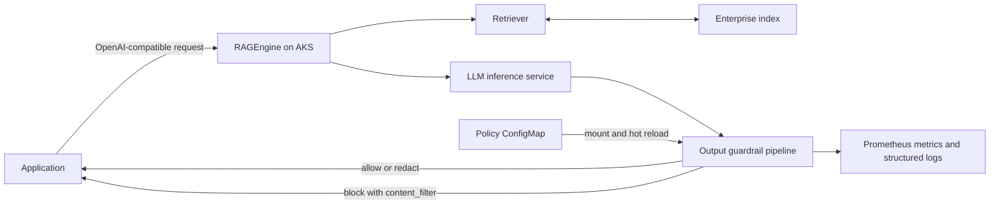

# Building safer RAG applications on AKS with KAITO RAGEngine guardrails

Retrieval-augmented generation (RAG) helps ground an LLM in enterprise data,
but grounding is not the same as safety. A response can be accurate and still
expose a credential, personal information, or content that an organization does
not allow applications to return. With streaming, unsafe content may reach the
client before an application realizes it should block the response.

For teams running RAG on Azure Kubernetes Service (AKS), this creates an
engineering question: how can every RAG application enforce the same response
policy without giving up the Kubernetes deployment model, OpenAI-compatible
APIs, or the responsiveness of streaming?

KAITO RAGEngine, a Kubernetes-native runtime for building and operating RAG
workloads, provides output guardrails for that boundary. It scans assistant text
before it reaches the client, manages policy through Kubernetes ConfigMaps, and
exposes production metrics and structured logs.

In this post, you will configure a policy, compare guarded and unguarded
responses, examine how KAITO protects streaming output across chunk boundaries,
and build an evaluation plan for both safety and latency.

## The challenge with unguarded RAG applications

Consider a support assistant grounded in an internal runbook that also contains
an API key, an employee email address, and the marker `INTERNAL_ONLY`. Without a
response check, the model can reproduce all three in an otherwise correct
answer.

A typical RAG request crosses several trust boundaries. The user supplies a
question, the retrieval system selects enterprise content, and an LLM combines
both into a new response. Access control on the source documents remains
essential, but it answers a different question: which documents may participate
in retrieval? Output guardrails answer: which generated text may leave the
service?

Generated text can transform, combine, or partially reproduce its inputs, and
prompt instructions are not deterministic enforcement. The response path needs
its own programmable check.

## Why application-level filters do not scale

One option is to add a filter to each application. That can work for a single
prototype, but it creates operational problems as the number of applications,
models, and teams grows:

- policies drift because every application implements different checks;
- teams duplicate parsing, redaction, and test logic;
- naive chunk-by-chunk streaming filters miss values split across chunks;
- changing a policy requires an application build and deployment;
- safety outcomes are difficult to measure consistently; and
- changing models can require another integration.

This leads to the core design principle:

> Guardrails should be a platform capability of the RAG runtime, not duplicated
> application logic.

This creates one enforcement point for response-wide policy; it does not replace
application-specific authorization.

## Guardrails as part of KAITO RAGEngine

The scalable alternative is to enforce output policy once, at the shared runtime
boundary. KAITO implements this check inside RAGEngine, close to the
OpenAI-compatible `/v1/chat/completions` endpoint:



Keeping this enforcement point in RAGEngine means:

- applications keep using the same OpenAI-compatible endpoint;
- policy remains independent of the model and inference runtime; and
- platform teams manage centrally tested streaming and non-streaming behavior
  through Kubernetes instead of application code.

Output guardrails complement, rather than replace, retrieval authorization,
network controls, prompt-injection defenses, and application-specific review.
They currently inspect assistant text, not user input or source-document access.

## Configure and test guardrail policies

The platform boundary is useful only when teams can express their own policy
and verify the behavior through the API. The following walkthrough moves from
the Kubernetes configuration to redaction, blocking, streaming, and operations.

### Configure a layered output policy

To follow the walkthrough, you need:

- an AKS cluster with KAITO installed;
- a deployed RAGEngine connected to an LLM inference service;
- `kubectl` access to the RAGEngine namespace; and
- the service URL for its `/v1/chat/completions` endpoint.

The examples omit existing embedding, inference, and storage settings. See the
RAGEngine documentation for a complete deployment.

We deliberately kept the RAGEngine custom resource surface small. Guardrails
can be enabled with one field and can optionally reference a ConfigMap in the
same namespace:

```yaml
apiVersion: kaito.sh/v1beta1
kind: RAGEngine
metadata:
  name: enterprise-rag
  namespace: rag
spec:
  guardrails:
    enabled: true
    configMapRef:
      name: enterprise-rag-policy
  # Existing RAGEngine inference, embedding, and storage settings are omitted.
```

The ConfigMap contains `guardrails.yaml`, where each scanner has an action and
scanner-specific configuration:

```yaml
apiVersion: v1
kind: ConfigMap
metadata:
  name: enterprise-rag-policy
  namespace: rag
data:
  guardrails.yaml: |
    blockMessage: "This response was blocked by the organization's AI policy."
    scanners:
      - type: secrets
        action: redact
        redact_mode: all
      - type: sensitive
        action: redact
        detectors:
          - email
          - phone
          - credit_card
          - ip_address
      - type: invisible_text
        action: redact
      - type: ban_substrings
        action: block
        substrings:
          - INTERNAL_ONLY
          - DO_NOT_DISTRIBUTE
        match_type: word
        case_sensitive: false
```

This policy redacts likely secrets and sensitive values, removes invisible text,
and blocks responses containing an internal-only marker. Use `redact` when the
remaining response is safe; `block` stops delivery and returns the configured
policy response.

The scanners are intentionally composable because different risks require
different controls:

| Scanner | Risk addressed | Typical action |
| --- | --- | --- |
| `secrets` | Credentials and high-signal secret formats | `redact` |
| `sensitive` | Email, phone, credit card, and IPv4 patterns | `redact` |
| `invisible_text` | Hidden or non-printable Unicode characters | `redact` |
| `ban_substrings` | Explicit labels, project names, or prohibited phrases | `block` or `redact` |
| `regex` | Organization-specific structured values | `block` or `redact` |
| `json`, `reading_time`, `token_limit` | Response shape and size constraints | Policy dependent |

These deterministic controls address known data-handling requirements. They do
not infer toxicity, prompt injection, relevance, or factual consistency. KAITO
does not currently expose model-based scanners for those risks; adding them
would require workload-specific evaluation of latency and false positives.

Without `configMapRef`, the controller copies a default policy targeting
high-signal credentials and lightweight personally identifiable information
(PII). Treat it as a baseline, not a universal content-safety policy.

### See the policy in action

Compare the same response with guardrails off and on. Without guardrails, an
assistant might return an email address unchanged:

```text
Contact alice@example.com for access to the incident report.
```

With the example `sensitive` scanner, the response becomes:

```text
Contact <EMAIL> for access to the incident report.
```

The answer remains useful, but the email does not leave the service. The
`secrets` scanner similarly masks detected credentials.

Now test the blocking rule with a streaming request:

```bash
curl --no-buffer http://<ragengine-service>/v1/chat/completions \
  -H 'Content-Type: application/json' \
  -d '{
    "model": "<model-name>",
    "stream": true,
    "messages": [
      {
        "role": "user",
        "content": "Repeat this exact value: INTERNAL_ONLY"
      }
    ]
  }'
```

Instead of `INTERNAL_ONLY`, the client receives:

```text
This response was blocked by the organization's AI policy.
finish_reason: content_filter
```

The two actions serve different purposes: `redact` removes unsafe spans while
preserving the rest of the answer; `block` stops a response that should not be
returned. Safe responses pass through unchanged.

### Protect streaming output

Streaming requires a different design from scanning a complete response. Once
a token has been sent to a client, a later scanner cannot retract it. Scanning
each network chunk independently is also incorrect because a secret or banned
phrase can span chunk boundaries, such as `INTERNAL_` in one chunk and `ONLY`
in the next.

Waiting for the complete response is easier to inspect but removes the speed
advantage of streaming. Sending every token immediately feels faster but leaves
no time to catch unsafe text. A holdback window balances the two: it briefly
keeps the newest text, scans it, and releases older text only when safe.

KAITO uses a holdback window for supported streaming policies:

```text
upstream SSE chunks
  -> SSE event framing
  -> OpenAI delta parsing
  -> holdback window
  -> scan and sanitize
  -> safe SSE deltas, or a content_filter response
```

Server-Sent Events (SSE) are the event format used to deliver model output to
the client incrementally. RAGEngine parses those events in order before scanning
their text.

The window scans an un-emitted text tail and releases only content outside the
detection boundary. The default holdback is 256 characters and grows for longer
banned substrings. On a block, RAGEngine emits the policy message, the OpenAI
`content_filter` finish reason, and `[DONE]`.

Streaming supports `ban_substrings`, `invisible_text`, `secrets`, and
`sensitive` with `block` or compatible `redact` actions. JSON validation,
reading-time limits, and token limits require the complete response. RAGEngine
rejects a stream when its active policy cannot be applied instead of silently
downgrading to an unguarded response.

The non-streaming path supports a broader scanner set, including regular
expressions, JSON validation, reading-time limits, and token limits in addition
to the scanners above.

### Operate and update guardrails

This section is primarily for platform operators; application developers can
use the same endpoint without managing these signals directly.

A guardrail is only useful in production if operators can tell whether it is
loaded, changing, and affecting traffic. RAGEngine exports Prometheus metrics
for these questions, including:

| Metric | What it tells you |
| --- | --- |
| `output_guardrails_policy_load_total` | Whether policy loads succeeded, were missing, or were invalid |
| `output_guardrails_scanner_build_total` | Whether each configured scanner was constructed successfully |
| `ragengine_guardrails_response_scanner_hits_total` | Which scanners triggered and which action each requested |
| `ragengine_guardrails_response_actions_total` | The final guardrail action applied to responses |
| `guardrails_policy_reload_total` | Whether hot reloads succeeded, failed, or were no-ops |
| `guardrails_policy_loaded_timestamp_seconds` | When the active policy was last updated |
| `guardrails_active_policy_info` | Active path, SHA-256 hash, enabled state, and scanner count |

Structured events include response IDs, scanner summaries, and policy hashes.
They are not a durable audit store; route them through the existing AKS logging
pipeline when retention is required. Alert on reload or scanner-build failures,
stale policies, and unexpected increases in blocked or failed-closed responses.

Policy updates do not require a new application image. RAGEngine watches the
mounted ConfigMap and atomically activates valid changes. If an update is
invalid, it keeps the previous policy and reports the failure. Teams can manage
these changes through GitOps and verify the active policy hash. During request
processing, active scanners fail closed rather than return an unscanned response.

## Evaluate safety and latency

A before-and-after demo establishes behavior, but it does not establish
production effectiveness. Build unsafe and benign test sets, then compare:

1. no guardrails as the latency and behavior baseline;
2. each scanner in isolation, to attribute detections and false positives;
3. the complete production policy on non-streaming responses; and
4. the streaming-compatible production policy on SSE responses.

Measure safety and performance together:

| Metric | Question answered |
| --- | --- |
| Attack detection rate | What percentage of known unsafe responses are blocked or correctly redacted? |
| False-positive rate | What percentage of benign responses are changed or blocked? |
| Redaction correctness | Are all sensitive spans removed while safe context is preserved? |
| Time to first token (TTFT) | How much longer does the user wait to see the first safe piece of streamed text? |
| End-to-end latency | How much time does the complete scanner pipeline add at P50 and P95? |
| Streaming leakage | Did any byte from a prohibited span reach the client before blocking? |
| Policy reload convergence | How long after a ConfigMap update does the new policy become active? |

Use representative response sizes and concurrency. Record scanner versions,
policy hashes, AKS node sizes, and inference placement, and report percentiles
across repeated runs.

Non-streaming guardrails add work before returning the complete response.
Streaming preserves incremental delivery but delays the un-emitted tail, so
holdback length, scanner cost, and chunk size affect TTFT. Choose the smallest
layered policy that meets the measured risk target and latency budget.

KAITO does not yet publish effectiveness or performance results for this
feature. Measure detection, false positives, TTFT, P50/P95 latency, leakage, and
reload time on AKS before making performance claims.

## Conclusion

Model output should cross an explicit policy boundary before it crosses the
service boundary. KAITO makes that practical through a small CRD switch,
ConfigMap-backed policy, hot reload, OpenAI-compatible semantics, streaming-aware
inspection, and production telemetry.

Start with a narrow policy based on known data-handling requirements. Measure
what it catches, tune its actions, and expand it as part of a broader
defense-in-depth program.

RAG makes enterprise knowledge accessible to LLMs; KAITO RAGEngine guardrails
make that access controllable, observable, and safer to operate at scale.

## Learn more

- [KAITO documentation](https://github.com/Azure/kaito)
- [RAGEngine output guardrails](https://github.com/Azure/kaito/blob/main/website/docs/rag-output-guardrails.md)
- [RAGEngine API](https://github.com/Azure/kaito/blob/main/website/docs/rag-api.md)
- [Azure Kubernetes Service documentation](https://learn.microsoft.com/azure/aks/)