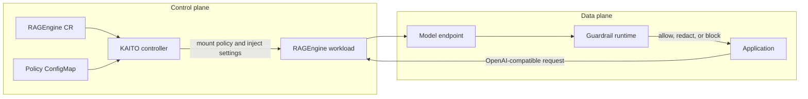
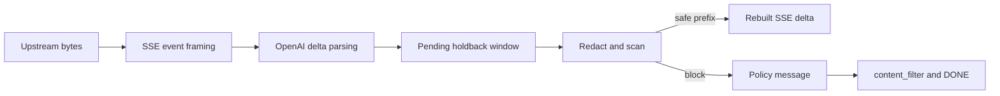

# Building Safer RAG Applications on AKS with KAITO RAGEngine Guardrails

## Challenge: Grounded Does Not Mean Safe

An enterprise RAG application retrieves an internal troubleshooting document containing an API credential, an employee email address, and a confidential project name. Retrieval improves the answer, but the model may also reproduce that information, potentially token by token through a streaming API.

Deterministic scanners can block or redact recognizable risks such as credentials, personal information, invisible Unicode, and prohibited terms. Semantic risks, including unsupported answers, toxicity, topic violations, and instruction overrides, require model-based evaluation rather than pattern matching alone.

> **Grounding gives the model relevant evidence for its response. Guardrails enforce what content the application is allowed to return.**

KAITO RAGEngine currently provides centrally managed output guardrails for standard and streaming responses, with blocking, redaction, hot reload, and telemetry. This post configures and evaluates those controls on Azure Kubernetes Service (AKS), explains cross-chunk protection, and considers future semantic checks. RAGEngine does not currently scan user input or retrieved context or provide model-based scanners.

## Why Application-Level Filters Do Not Scale

An application can call a filtering library before returning a model response. For one service, that may be sufficient. At platform scale, every team must repeat scanner initialization, policy parsing, actions, failure handling, streaming logic, and telemetry. These implementations and their policy versions quickly diverge.

Streaming turns inconsistency into a leakage risk. Scanning after generation is too late for an SSE response:

```text
Model -> SSE chunks -> Client
			^
			unsafe text may already be visible
```

Once a chunk reaches the client, it cannot be retracted. Independent chunk scanning also misses credentials or phrases split across boundaries; safe streaming requires ordered buffering before release.

Application-owned policy also couples rule changes to release cycles. A platform-level guardrail replaces repeated builds and deployments with:

```text
Update ConfigMap -> reload policy at runtime -> keep using the same endpoint
```

RAGEngine already sits on the OpenAI-compatible response path between applications and model endpoints, making it a natural enforcement point before output reaches the client. Applications keep the same API integration while platform teams manage policy, streaming safety, updates, and observability in one place.

## Guardrails as a RAGEngine Runtime Capability

RAGEngine separates policy management from response enforcement. The control plane configures guardrails through Kubernetes; the data plane applies the active policy before assistant output reaches the client.

This separation keeps scanner lifecycle out of application code and applies one enforcement model across supported inference endpoints.



Users enable the feature with `spec.guardrails.enabled` and optionally select a policy ConfigMap through `configMapRef`. The controller resolves and mounts the policy and injects the enabled state and path. Applications continue calling the same OpenAI-compatible endpoint without loading scanners or adding filtering code.

At runtime, RAGEngine parses the YAML, validates scanner settings, and builds the pipeline. Unsupported or incompatible scanner entries are skipped and reported; active scanner failures fail closed rather than return unscanned output.

Policy and application releases have separate lifecycles. A ConfigMap change builds a new snapshot and atomically replaces the active one. A reloader failure keeps the current snapshot and reports the outcome without restarting the Pod.

The `/v1/chat/completions` endpoint scans complete non-streaming responses. Streaming responses use SSE parsing, a holdback window, and a compatible scanner subset. Both paths share one policy model, while metrics report policy loads and reloads, scanner construction and hits, and final actions. Enforcement currently covers assistant text only.

## Configure Policy-Driven Output Protection

A policy combines three elements: `type` selects the risk, `action` chooses `block` or `redact`, and scanner-specific options define detectors, substrings, matching, or limits. One policy can therefore redact credentials and personal information while blocking an internal project name.

This ConfigMap is compatible with non-streaming and streaming responses:

```yaml
apiVersion: v1
kind: ConfigMap
metadata:
  name: ragengine-guardrails-policy
data:
  guardrails.yaml: |
    blockMessage: The response was blocked by output guardrails.
    scanners:
      - type: secrets
        action: redact
        redact_mode: all
      - type: sensitive
        action: redact
        detectors:
          - email
          - phone
          - credit_card
          - ip_address
      - type: invisible_text
        action: redact
      - type: ban_substrings
        action: block
        substrings:
          - SECRET_PROJECT
        match_type: word
        case_sensitive: false
```

Some checks require the complete response:

| Scanner | Non-streaming | Streaming |
| --- | --- | --- |
| `ban_substrings` | Yes | Yes |
| `secrets` | Yes | Yes |
| `sensitive` | Yes | Yes |
| `invisible_text` | Yes | Yes |
| `regex` | Yes | No |
| `json` | Yes | No |
| `reading_time` | Yes | No |
| `token_limit` | Yes | No |

Streaming secret redaction requires `redact_mode: all` and a single choice at index `0`; an incompatible policy is rejected for streaming. For non-streaming output, scanners run in policy order, so redaction can change what later scanners observe. Streaming applies compatible redactions before block checks within each window. Test the combined policy, not only individual scanners.

## Protect Streaming Responses Across Chunk Boundaries

Buffering a complete response gives scanners full context but removes incremental delivery. Scanning and forwarding each chunk is responsive, but network chunks are not policy boundaries: a prohibited value can span chunks, and released text cannot be retracted.

For example, an AWS access key ID can arrive as:

```text
Chunk 1: "The API key is AKIA12"
Chunk 2: "34567890123456."
```

Neither chunk contains the complete value. RAGEngine instead retains the newest text in a holdback window.



RAGEngine frames OpenAI-compatible SSE events, extracts textual `delta.content`, appends it to pending text, and scans the combined window. It releases only the prefix outside the holdback boundary, allowing the scanner to see `AKIA1234567890123456` as one candidate. The retained tail returns to the configured holdback size after each release instead of growing with the response.

At `finish_reason`, `[DONE]`, or upstream end, RAGEngine flushes and scans the remaining window. A block discards pending text and emits the policy message, an OpenAI `content_filter` finish reason, and `[DONE]`.

Redaction can change text length, so offsets derived from original content are unsafe. RAGEngine replaces pending text with the sanitized result and recalculates the releasable prefix, preventing partial, duplicated, or missing output.

Word matching requires both boundaries. With `match_type: word`, `SECRET_PROJECT is active` matches, while `MY_SECRET_PROJECT_ARCHIVE` does not. RAGEngine retains the preceding emitted character for the left boundary. If the right character has not arrived, the candidate remains pending; flush treats the response end as the final boundary.

Secret redaction adds verification: RAGEngine scans the sanitized result again and fails closed if it cannot confirm removal. Malformed SSE, multiple choices, unsupported policy combinations, or scanner failures likewise produce a refusal instead of uncertain output.

The holdback is a safety boundary, not only a delay. It keeps values that begin near an emission boundary from leaking before the runtime can determine whether later characters complete a secret or prohibited word. Policies with longer banned substrings increase the retained tail, trading first-visible-token latency for a wider detection boundary.

The default window retains 256 characters and grows for longer banned substrings, providing adjacent text without retaining the complete response.

RAGEngine therefore treats streaming output as one ordered text stream and releases only text confirmed safe.

## See Guardrails in Action

The application uses the same request and endpoint in each example; only the policy changes the result.

### Redact sensitive data

The `sensitive` scanner removes detected values while preserving the answer:

```text
Without: Email alice@example.com, call +1 (206) 555-0100,
         use 4111 1111 1111 1111 from 10.0.0.1.

With:    Email <EMAIL>, call <PHONE>,
         use <CREDIT_CARD> from <IP_ADDRESS>.
```

With `action: redact`, RAGEngine returns the remaining context normally.

The request body and endpoint are unchanged; the scanner action controls only the returned assistant text.

### Redact a secret split across chunks

Suppose the model splits an AWS access key across two SSE deltas:

```text
Upstream chunk 1: "AWS key: AKIA1234"
Upstream chunk 2: "567890ABCDEF"
```

The holdback window combines and scans pending text before release:

| Upstream | Pending window | Client-visible output |
| --- | --- | --- |
| Secret split across chunks | `AKIA1234567890ABCDEF` | `AWS key: ******` |

The client never receives the first half, and the complete secret appears in no downstream chunk.

This is the key streaming result: client-visible leakage remains zero even though the upstream value crosses an event boundary.

### Block a prohibited term

With `ban_substrings`, `action: block`, and `match_type: word`, `SECRET_PROJECT` produces:

```text
This response was blocked by output guardrails.
finish_reason: content_filter
[DONE]
```

`SECRET_PROJECT_ARCHIVE` does not match because the underscore continues the word.

On a match, RAGEngine discards pending original text before emitting the configured refusal sequence.

Add `CONFIDENTIAL_ALPHA` to the ConfigMap and RAGEngine reloads it without restarting the Pod or changing the endpoint. The reload metric and active policy metadata confirm the update.

## From Pattern Matching to Semantic Protection

Deterministic scanners protect known patterns, but a response can contain no secret, PII, prohibited term, or invalid JSON and still be irrelevant or unsupported by retrieved evidence.

Future model-based scanners could assess relevance, toxicity, or topic policy. Factual consistency also needs retrieved evidence as scanner input, while prompt-injection detection belongs on an input-side hook before retrieval and inference.

> **Model-based scanners should complement fast rule- and pattern-based checks rather than replace them.**

KAITO does not currently expose these scanners. Adding them requires context plumbing, thresholds, fallback behavior, and measurement of quality, latency, and resource cost.

They are context-aware, but more expensive.

## Evaluate Safety and Performance

Evaluate four profiles rather than reporting configuration alone:

| Configuration | Purpose |
| --- | --- |
| No guardrails | Establish the latency baseline |
| Non-streaming guardrails | Measure full-response scanning cost |
| Streaming block only | Measure holdback and blocking overhead |
| Streaming redact and block | Measure sanitization overhead |

Use positive, negative, boundary, and malformed samples. Report detection errors, redaction correctness, cross-chunk detection, and the defining streaming metric:

```text
Leakage bytes = unsafe bytes delivered to the client before enforcement
```

Target zero leakage and verify valid SSE. Separate model TTFT from guardrail-induced first-visible-token delay; report P50, P95, and P99 latency, throughput, resource use, and reload time across allow, redact, and block paths. KAITO does not yet publish benchmark results.

## Operational Considerations and Current Scope

ConfigMaps, hot reload, fail-closed execution, metrics, and logs separate policy operations from application releases. Current enforcement covers assistant text; streaming supports a scanner subset and one choice, while tool-call arguments, input scanning, and retrieved-context checks are outside scope.

> **Guardrails are one layer of defense, not a replacement for RBAC, network policies, secret management, data access controls, or secure retrieval design.**

## Conclusion

KAITO RAGEngine gives applications one OpenAI-compatible API, platform teams Kubernetes-managed policy, and security teams consistent enforcement and telemetry. Deterministic scanners and streaming holdback protect current workloads, while the same architecture can support future semantic checks.
