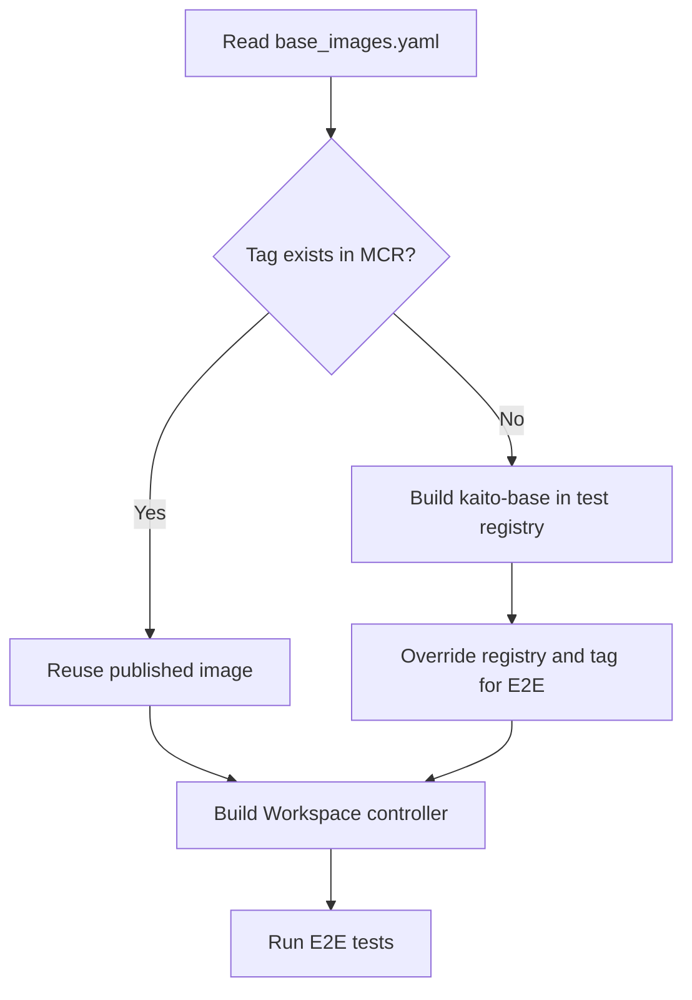

# KAITO Base Image Building Process

This document describes how KAITO builds and publishes its shared inference runtime image.

## Source of Truth

[`presets/workspace/models/base_images.yaml`](../presets/workspace/models/base_images.yaml) records the published base image tag and the runtime versions it contains. The Workspace controller embeds this file at build time.

Model metadata is maintained separately in [`presets/workspace/models/model_catalog.yaml`](../presets/workspace/models/model_catalog.yaml).

## Pull Request Validation

The E2E workflow uses `.github/determine_missing_base_images.py` to check whether the configured `kaito-base` tag exists in MCR. When the image is missing, `.github/actions/e2e-base-setup/action.yaml` builds it in the test registry and updates the embedded base image metadata before building the Workspace controller.



## Production Publishing

Changes to `base_images.yaml` trigger `.github/workflows/publish-runtime-mcr-image.yaml`. The workflow checks the configured tag and publishes `kaito-base` when that tag is absent.

The image is built from `docker/presets/models/tfs/Dockerfile`. Update the tag and `runtimeVersion` fields together so deployed workloads report the versions baked into the image.

## Validation

Keep the Helm mirror synchronized and run the applicable checks:

```bash
make compare-base-image-configs
make unit-test
```

For a runtime upgrade, also regenerate the vLLM architecture allowlist after the new image is pullable:

```bash
make generate-vllm-arch-list
```
