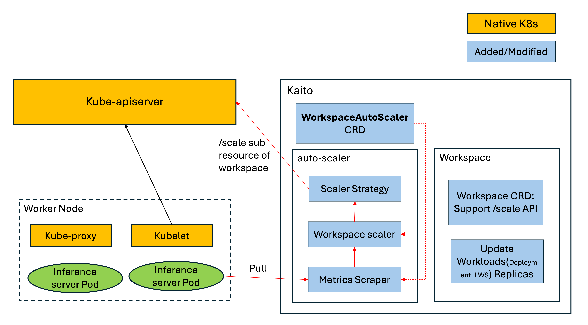

# Title

Auto Scaler for inference workloads in Kaito

## Summary

As the gpu usage of inference workloads increases, It is necessary to scale more inference instances in order to preventing to block inference requests. on the other hand, If the gpu usage of inference workload declines, we should consider to reduce inference instances for improving gpu resource utilization.
Native Kubernetes has provided HPA capability to scale workload instance automatically as the metrics change. but HPA depends the third-party components(like prometheus, prometheus-adapter, etc.) to collect custom metrics from the source pods.

In this proposal, we hope to make an auto-scaler proposal for scaling inference workloads automatically in terms of changes of custom metrics from inference pods, and this auto scaler doesn't depend on other components(this means Kaito is a self-contained component without dependencies).

## Motivation

LLM inference service is a baisc and widly-used feature in Kaito, and Kaito community interest in auto scaler for inference workloads continues to intensify, related issues: [#306](https://github.com/kaito-project/kaito/issues/306), [#1104](https://github.com/kaito-project/kaito/issues/1104).

From the technical perspective, It's a good idea to provide auto-scaler capability, becasue the auto-scaler of inference workloads dynamically adjusts the number of inference instances based on request volume--scaling up during traffic spikes to improve inference speed, and scaling down during low demand to minimize GPU resource waste.

To ensure ease of use, we aim to implement a fully integrated auto-scaler within Kaito, eliminating the need for any third-party dependencies. At the same time, we will maintain extensibility, allowing Kaito's workspace resources to intergate with Kubernetes's native HPA solution.


### Goals

- Kaito is self-contained to scale inference workloads automatically according to specified metric changes.
- Support /scale subresource API for Workspace CRD.
- Support metric scraping windows and tolerance durations in scale strategy for mitigating the impact of metric noise.

### Non-Goals/Future Work

- Support scheduled scaler(like cron job) for gpu workloads in future version.
- Only support to configure one metric for scaling, mutiple metrics will be supported in future version.
- Support distributed inference auto scaling after LWS is used for managing distributed inference workloads.
- The time efficiency of the auto-scaler is not within the scope of this proposal, as it is influenced by mutliple external factors, including GPU node provisioning, LLM image pulling, etc.

## Proposal

### Auto-Scaler Architecture

The auto-scaler in Kaito scrapes metrics from inference pod according to configurations in InferenceAutoScaler CRD, and scaler controller calculate desired replicas by integrating scraped metrics and scaler strategy,
then scale workspace replicas through /scale subresource API. The detailed auto-scaler architecture is shown in the following figure:



- InferenceAutoScaler CRD: is used as auto-scaler configuration(including scale strategy, target reference, etc.) for specified workspace resource.
- Metrics Scraper: a module in auto-scaler of Kaito and used for scraping metrics from inference pod.
- Scaler Strategy: is used to calculate the desired replicas for scaling. different scaling strategies have different calculation methods. In this proposal, only one scaling strategy will be introduced. and more strategies will be supported in future versions.
- Scaler Controller: is used for integrating metrics scraper and scaler strategy, also including revoke /scale subresource API.
- Workspace CRD/Controller: support /scale subresource API for Workspace CRD, and update underlay workloads(like Deployment, StatefulSet, etc.) according to desired replicas of Workspace.

### InferenceAutoScaler CRD

```
type MetricSourceType string

const (
	// PODS means fetch metrics from /metrics endpoint of pods which specified by selector.
	PODS MetricSourceType = "pods"
)

type ProtocolType string

const (
	HTTP  ProtocolType = "http"
	HTTPS ProtocolType = "https"
)

// MetricTargetType specifies the type of metric being targeted, only "Utilization" is supported currently.
type MetricTargetType string

const (
	// UtilizationMetricType declares a MetricTarget is an AverageUtilization value
	UtilizationMetricType MetricTargetType = "Utilization"
)

// MetricIdentifier defines the way to fetch the specific metric
type MetricIdentifier struct {
	// Name identifies the specific metric to monitor (e.g. vllm:gpu_cache_usage_perc).
	Name string

	// Type is the type of metric source. only pods type is supported currently.
	Type MetricSourceType

	// selector is the string-encoded form of a standard kubernetes label selector for the given metric.
	// if unset, a selector related to ScaleTargetRef will be configured(like workspace specified labels).
	Selector *metav1.LabelSelector

	// Protocol specify the protocol for accessing pods, http and https are supported.
	Protocol ProtocolType

	// Port specify the port of pods /metrics endpoint.
	Port string
}

// MetricTarget defines the target value of a specific metric
type MetricTarget struct {
	// type represents the target metric type, only average utilization is supported currently.
	Type MetricTargetType

	// averageUtilization is the target value of the average of the
	// resource metric across all relevant pods, represented as a percentage of
	// the requested value of the resource for the pods.
	AverageUtilization *int32
}

type MetricSource struct {
	// metric identifies the way to fetch target metric
	Metric MetricIdentifier

	// target specifies the target value for the given metric
	Target MetricTarget
}

type InferenceScalingRule struct {
	// stabilizationWindowSeconds is the number of seconds for which past recommendations should be
	// considered while scaling up or scaling down.
	// StabilizationWindowSeconds must be greater than or equal to zero and less than or equal to 3600 (one hour).
	// If not set, use the default values:
	// - For scale up: 60 (i.e. the stabilization window is 1min long).
	// - For scale down: 600 (i.e. the stabilization window is 10min long).
	// +optional
	StabilizationWindowSeconds *int32

	// tolerance is the tolerance on the ratio between the current and desired
	// metric value under which no updates are made to the desired number of
	// replicas (e.g. 0.01 for 1%). Must be greater than or equal to zero. If not
	// set, the default cluster-wide tolerance is applied (by default 10%).
	//
	// For example, if autoscaling is configured with a memory consumption target of 100Mi,
	// and scale-down and scale-up tolerances of 5% and 1% respectively, scaling will be
	// triggered when the actual consumption falls below 95Mi or exceeds 101Mi.
	//
	// +optional
	Tolerance *resource.Quantity
}

type ScaleStrategy struct {
	// scaleUp is scale strategy for scaling Up.
	// +optional
	ScaleUp *InferenceScalingRule

	// scaleDown is scale strategy for scaling Down.
	// +optional
	ScaleDown *InferenceScalingRule
}

type InferenceAutoScalerSpec struct {
	// scaleTargetRef points to the target resource to scale. e.g. Workspace
	ScaleTargetRef autoscalingv2api.CrossVersionObjectReference

	// MinReplicas is the lower limit for the number of replicas to which the autoscaler
	// can scale down. Default value is 1.
	// +optional
	MinReplicas *int32

	// MaxReplicas is the upper limit for the number of replicas to which the autoscaler can scale up.
	// It cannot be less that MinReplicas.
	MaxReplicas int32

	// metrics contains the specifications for which to use to calculate the
	// desired replica count. only one metric is supported currently, and multiple metrics will be supported in future version.
	Metrics []MetricSource

	// Strategy configures the scale strategy of the target in both Up and Down directions (scaleUp and scaleDown fields respectively).
	// If not set, the default InferenceScalingRule for scale up and scale down are used.
	// +optional
	Strategy *ScaleStrategy
}

type InferenceAutoScalerStatus struct {
	// lastScaleTime is the last time the InferenceAutoScaler scaled the number of inference workloads,
	// used by the autoscaler to control how often the number of inference workloads is changed.
	// +optional
	LastScaleTime *metav1.Time

	// currentReplicas is current number of replicas of inference workloads managed by this autoscaler,
	// as last seen by the autoscaler.
	// +optional
	CurrentReplicas int32

	// desiredReplicas is the desired number of replicas of inference workloads managed by this autoscaler,
	// as last calculated by the autoscaler.
	DesiredReplicas int32

	// Conditions is the set of conditions required for this autoscaler to scale its target,
	// and indicates whether or not those conditions are met.
	Conditions []metav1.Condition
}

type InferenceAutoScaler struct {
	metav1.TypeMeta
	metav1.ObjectMeta

	Spec   InferenceAutoScalerSpec
	Status InferenceAutoScalerStatus
}
```

The details of fields in InferenceAutoScaler CRD are described in `Metrics Scraper` and `Scale Strategy`.

### Metrics Scraper

- Metrics Scraper fetches specified metrics from pods' /metrics endpoint according to `InferenceAutoScaler.Spec.Metrics` at 15s interval. only one metric is supported in the first version.
- metrics endpoint url: `InferenceAutoScaler.Spec.Metrics[0].Metric.Protocol://{pod ip}:InferenceAutoScaler.Spec.Metrics[0].Metric.Port/metrics`
- pod ip: get ip from pods that specified by InferenceAutoScaler.Spec.Metrics[0].Metric.Selector
- resolve metric value from response by `InferenceAutoScaler.Spec.Metrics[0].Metric.Name`
- If there are multiple pods are selected, average metric value should be calculated.
- If the specified metric can not resolved from the pod, the pod should be skiped when calculating the average usage.

### Scale Strategy Detail

The scale stragegy should consider the following scenarios:
- scaling actions are skipped if the usage ratio(current usage/expect usage) is approximately 1 in order to avoid flapping.
- it takes a bit too much time to provision gpu node(nealy 7min), so we should prevent a constant fluctuation in the number of inference instances if the traffic/load fluctuates over a short period.
- the cost of gpu resource is really high, the scale rate should be controlled.

In order to eliminating the influence from the above issues, `InferenceAutoScaler` CRD has defined the following fields to improve it. take ScaleUp as an example:
- `InferenceAutoScaler.Spec.Strategy.ScaleUp.Tolerance`:

The tolerance field defines the relative threshold for deciding whether a scaling action is needed. If the current metric value is within tolerance%(plus/minas) of the desired target, Inference scaler will not trigger scaling, to avoid unnecessary sensitivity.

Default value is 0.1 which means a 10% deviation is tolerated.

- `InferenceAutoScaler.Spec.Strategy.ScaleUp.StabilizationWindowSeconds`:

This field is used for stablizing scaling decisions, and can avoid flip-flop of workload instances caused by metric spikes or drops.

| Direction | what scaler takes from the stabilization window | paratical effect |
|----------|----------|----------|
| Scale-up    | the smallest "desiredReplicas" number during last N seconds   | avoid reacting too aggressively to a spike   |
| Scale-down  | the largest "desiredReplicas" number during last N seconds   | avoid premature cutting replicas and possible service instability   |


* Example: Slow startup service(like inference service):

The stabilizationWindowSeconds use the default value as following:

```
scaleUp:
  stabilizationWindowSeconds: 60    # 1 minute window
scaleDown:
  stabilizationWindowSeconds: 600   # 10 minute window(application startup duration * 1.5) 
```

Assumptions:
  - controller sync every 15s
  - initial replicas = 4

| Time(s) | desiredReplicas | recommedations window |  value picked by scaleup window rule |  value picked by scaledown window rule |  action(new replicas) |
|----------|----------|----------|----------|----------|----------|
| 0     | 4   | {4}   | 4    | 4   | 4(no action)   |
| 15    | 9   |  {4, 9}   |  4    | 9   | 4   |
| 30    | 5   | {4, 9, 5}   | 4    | 9   | 4   |
| 45    | 11  | {4, 9, 5, 11}   | 4    | 11   | 4   |
| 60    | 5   | {4, 9, 5, 11, 5}   | 4    | 11   | 4   |
| 75    | 5   | {4, 9, 5, 11, 5, 5}   | 5(1 minute window)    | 11   |  scale-up 4->5   |
| 90    | 6   | {4, 9, 5, 11, 5, 5, 6}   | 5    | 11   |  5   |
| 105   | 4   | {4, 9, 5, 11, 5, 5, 6, 4}   | 4    | 11   |  5   |
| 120   | 4   | {4, 9, 5, 11, 5, 5, 6, 4, 4}   | 4    | 11   |  5   |
| 135   | 4   | {4, 9, 5, 11, 5, 5, 6, 4, 4, 4}   | 4    | 11   |  5   |
| 150   | 4   | {4, 9, 5, 11, 5, 5, 6, 4, 4, 4, 4}   | 4    | 11   |  5   |
| ...   | 4   | {4, 9, 5, 11, 5, 5, 6, 4, 4, 4, 4, ...}   | 4    | 11   |  5   |
| 690   | 4   | {4, 9, 5, 11, 5, 5, 6, 4, 4, 4, 4, ..., 4}   | 4    | 5   |  5   |
| 705   | 4   | {4, 9, 5, 11, 5, 5, 6, 4, 4, 4, 4, ..., 4, 4}   | 4    | 4(10 minute window)   |  scale-down 5 ->4   |

so the workloads can be scaled up in one minute after specified metric changes, and one-off spike(like 9, 11 spike in above table) can be skipped. on the other hand, the workloads can only be scaled down after 10 minutes even metric has returned normally, for ensuring new instances have started before scaling down.

- Scale Rate for Inference workloads

Ensure don't scale-up too much to prevent incorrect rapid increase of the number of inference instances caused by metric spike change.

The Default scale-up rate is 2.0, meaning the number of replicas can at most double during a scale-up action. Additionally, to accelerate initial scaling, the number of replicas can increase up to 4 directly.


### Scale Strategy Pseudocode

Inputs:

- ExpectedUsage: expected usage of the specified metric, related field: `InferenceAutoScaler.Spec.Metrics[0].Target.AverageUtilization`
- CurrentUsage: Actual usage of the specified metric, resolved from pods by metric scraper.
- MinReplicas: The max number of replicas for target object, related field: `InferenceAutoScaler.Spec.MinReplicas`
- MaxReplicas: The max number of replicas for target object, related field: `InferenceAutoScaler.Spec.MaxReplicas`
- CurrentReplicas: Actual number of instances for target workload, resolved from /scale subresource API.
- UpTolerance: the fluctuation ratio for scaling up, related field: `InferenceAutoScaler.Spec.Strategy.ScaleUp.Tolerance`
- DownTolerance: the fluctuation ratio for scaling down, related field: `InferenceAutoScaler.Spec.Strategy.ScaleDown.Tolerance`
- UpStabilizationWindowSeconds: the stabilization window seconds of scaling up action, related field: `InferenceAutoScaler.Spec.Strategy.ScaleUp.StabilizationWindowSeconds`
- DownStabilizationWindowSeconds: the stabilization window seconds of scaling down action, related field: `InferenceAutoScaler.Spec.Strategy.ScaleDown.StabilizationWindowSeconds`
- Recommendations: map[string][]timestampedRecommendation, is used for storing the old desired replicas with timestamp.
- ScaleUpRate: 2.0, and can be configured through startup parameter.

Outputs:

- DesiredReplicas: Desired number of replicas for target workload. and the value will be used for scaling workload through /Scale subresource api.

```
// 1. calculate the desired replicas based current usage and expected usage, skip calculation if the deviaton within toleration.
DesiredReplicas = CurrentReplicas
if CurrentUsage/ExpectedUsage > (1 + UpTolerance) || CurrentUsage/ExpectedUsage < (1 - DownTolerance) {
  DesiredReplicas = CurrentReplicas * CurrentUsage / ExpectedUsage
}

// 2. stabilize replicas with recommendations
storedDesiredReplicas := DesiredReplicas
upRecommendation := DesiredReplicas
upCutoff := now.Add(-time.Second * time.Duration(UpStabilizationWindowSeconds))

downRecommendation := DesiredReplicas
downCutoff := now.Add(-time.Second * time.Duration(DownStabilizationWindowSeconds))
for i, rec := range Recommendations.[InferenceAutoScaler.Name] {
  // get the smallest value in last UpStabilizationWindowSeconds for scaling up stabilizaiton.
  if rec.timestamp.After(upCutoff) {
    upRecommendation = min(rec.recommendation, upRecommendation)
  }

  // get the largest value in last DownStabilizationWindowSeconds for scaling up stabilizaiton.
  if rec.timestamp.After(downCutoff) {
    downRecommendation = max(rec.recommendation, downRecommendation)
  }
}

if CurrentReplicas < upRecommendation {
  // if current replicas is less than upRecommendation, scaler should scale up workloads.
  DesiredReplicas = upRecommendation
}

if CurrentReplicas > downRecommendation {
  // if current replicas is more than downRecommendation, scaler should scale down workloads.
  DesiredReplicas = downRecommendation
}

// store old desired replicas with timestamp
Recommendations[InferenceAutoScaler.Name] = append(Recommendations[InferenceAutoScaler.Name], timestampedRecommendation{storedDesiredReplicas, time.Now()})

// 3. limit the scale rate
minimumAllowedReplicas := MinReplicas
maximumAllowedReplicas := MaxReplicas
scaleUpLimit := math.Max(ScaleUpRate * CurrentReplicas, 4.0)
if maximumAllowedReplicas > scaleUpLimit {
  maximumAllowedReplicas = scaleUpLimit
}

if DesiredReplicas < minimumAllowedReplicas {
  DesiredReplicas = minimumAllowedReplicas
} else if DesiredReplicas > maximumAllowedReplicas {
  DesiredReplicas = maximumAllowedReplicas
}

```

### New Parameters For Kaito

The following startup parameters should be added for Kaito component.


| parameter | message | default value |
|----------|----------|----------|
| --inference-autoscaler-sync-period duration  | The period for syncing InferenceAutoScaler resource in scaler controller    | 15s    |
| --inference-autoscaler-tolerance float  | The minimum change (from 1.0) in the desired-to-actual metrics ratio for the inference autoscaler to consider scaling.    | 0.1    |
| --inference-autoscaler-upscale-stabilization duration  | The period for which autoscaler will look backwards and not scale up above any recommendation it made during that period.    | 60s   |
| --inference-autoscaler-downscale-stabilization duration  | The period for which autoscaler will look backwards and not scale down below any recommendation it made during that period.    | 600s   |
| --inference-autoscaler-upscale-rate float | The rate to calculate the limit number of instances during scale-up action.   | 2.0   |

### Support /scale subresource API

Ensure Workspace can be integrated with the native HPA of Kubernetes, We should support /scale subresource API for Workspace CRD.

so Workspace CRD should be updated as following:

```
# add replicas field in spec and status
type Workspace struct {
  ...
  Inference InferenceSpec{
	  // Number of desired inference instances, Default value is 1.
	  Replicas int32
    ...
  }
  Status WorkspaceStatus{
	  // Total number of running instances of this workspace.
	  // +optional
	  Replicas int32
    ...
  }
}

# add subresource for Workspace CRD, and recommend to use kubebuilder annotation to update CRD.

apiVersion: apiextensions.k8s.io/v1
kind: CustomResourceDefinition
metadata:
  annotations:
    controller-gen.kubebuilder.io/version: v0.15.0
  name: workspaces.kaito.sh
spec:
spec:
  group: kaito.sh
  names:
    categories:
    - workspace
    kind: Workspace
    listKind: WorkspaceList
    plural: workspaces
    shortNames:
    - wk
    - wks
    singular: workspace
  scope: Namespaced
  versions:
  ...
    served: true
    storage: true
    subresources:
      scale: # new added
        specReplicasPath: .spec.inference.replicas
        statusReplicasPath: .status.replicas
      status: {}
```

Workspace controller should update status.Replicas according to actual number of inference instances.

## Alternatives

### Native HPA

After supporting /scale subresource API for Workspace CRD, native HPA solution can also be used for scaling inference workloads of Kaito. But prometheus and prometheus-adapter should be installed and configured for preparing metrics.

## Implementation History
- [ ] 06/10/2025: Open proposal PR
