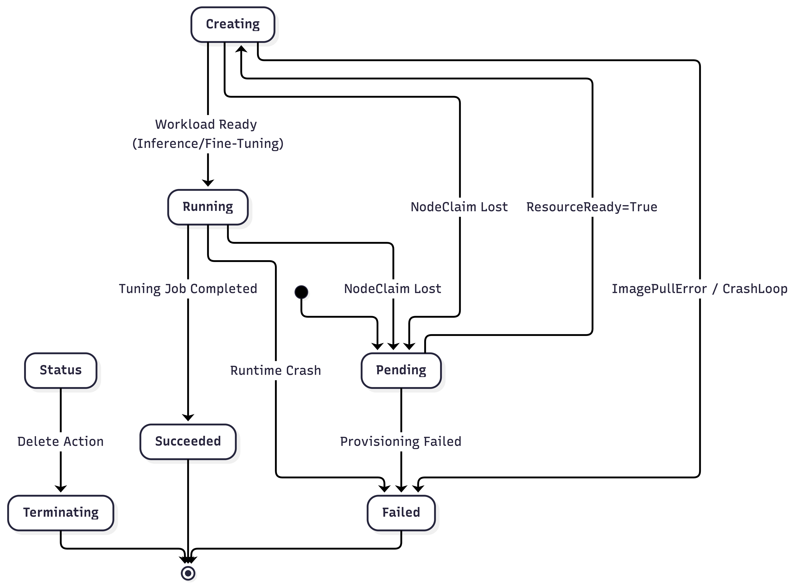

# Workspace Status Phase Design

## Background

Currently, the `Workspace` Custom Resource (CR) status relies heavily on a list of `Conditions` (e.g., `ResourceReady`, `InferenceReady`, `JobStarted`) to represent the state of the system. While `Conditions` are excellent for programmatic consumption and detailed status reporting, they present a few challenges for end-users:

1.  **Poor Readability**: Users must inspect the `status.conditions` array to understand the current state.
2.  **No High-Level Summary**: There is no single field that answers "Is my workspace working?" 
3.  **CLI Output**: `kubectl get workspace` typically requires complex `JSONPath` or custom printers to show meaningful status, often resulting in multiple columns (`ResourceReady`, `InferenceReady`) instead of one status column.

To address this, we propose adding a `Phase` field to the `WorkspaceStatus`. This field effectively aggregates the various conditions into a single, high-level finite state machine (FSM) enumeration, similar to how standard Kubernetes resources like `Pod` (Pending, Running, Succeeded, Failed) or `PersistentVolumeClaim` (Bound, Available) work.

## Design Proposal

We introduce a `Phase` field in `WorkspaceStatus` with the following definition:

```go
type WorkspacePhase string

const (
    // WorkspacePhasePending means the workspace is waiting for resources (e.g. GPU NodeClaims) to be ready.
    WorkspacePhasePending WorkspacePhase = "Pending"
    
    // WorkspacePhaseCreating means the resources are ready, and the workload (inference or tuning) is starting.
    WorkspacePhaseCreating WorkspacePhase = "Creating"
    
    // WorkspacePhaseRunning means the inference service is ready and serving requests.
    WorkspacePhaseRunning WorkspacePhase = "Running"
    
    // WorkspacePhaseSucceeded means the tuning job completed successfully.
    // This state is primarily for Batch/Tuning workloads.
    WorkspacePhaseSucceeded WorkspacePhase = "Succeeded"
    
    // WorkspacePhaseFailed means the workspace encountered a critical error.
    // Examples: Resource provisioning failed permanently, or Pod CrashLoopBackOff.
    WorkspacePhaseFailed WorkspacePhase = "Failed"
    
    // WorkspacePhaseTerminating means the workspace is being deleted.
    WorkspacePhaseTerminating WorkspacePhase = "Terminating"
)
```

### State Determination Logic

The `Phase` is a calculated field derived from the `Conditions` and `DeletionTimestamp`.

| Phase | Condition Logic | Description |
| :--- | :--- | :--- |
| **Terminating** | `metadata.deletionTimestamp != nil` | The resource is being deleted. |
| **Failed** | `ResourceReady=False` (Reason: ProvisionFailed) <br> OR `InferenceReady=False` (Reason: CrashLoop/ErrImagePull) | Critical failure requiring intervention. |
| **Pending** | `ResourceReady=False` (Reason: Pending/Provisioning) | Waiting for infrastructure (NodeClaims). |
| **Creating** | `ResourceReady=True` AND <br> (`InferenceReady=False` OR `JobStarted=False`) | Infrastructure ready, workload starting (Pulling images, Init). |
| **Running** | `ResourceReady=True` AND <br> (`InferenceReady=True` OR `JobStarted=True`) | **Inference**: Service is healthy. <br> **Tuning**: Job is currently running. |
| **Succeeded** | `ResourceReady=True` AND `WorkspaceSucceeded=True` | **Tuning**: Job completed successfully. |

### Handling NodeClaim Failure (Regression Scenario)

If a running Workspace (`Phase: Running`) loses its underlying NodeClaim:
1. The controller detects NodeClaim loss.
2. `ResourceReady` condition transitions to `False`.
3. The Phase logic re-evaluates: Since `ResourceReady` is `False`, the Phase transitions back to **Pending**.
4. The system attempts to provision a new NodeClaim.
5. Once the new NodeClaim is ready (`ResourceReady=True`), Phase transitions to **Creating** (waiting for Pods).
6. Finally, back to **Running**.

## State Diagram



## Pros and Cons

### Pros
*   **Improved User Experience**: Users can run `kubectl get workspace` and see `Running` or `Pending` immediately.
*   **Standardization**: Aligns with Kubernetes native API patterns.
*   **simplified Integration**: External tools (Dashboard, UI, CI/CD) can monitor a single field rather than parsing complex condition arrays.
*   **Clear Lifecycle**: Explicitly distinguishes between "Waiting for Infra" (`Pending`) and "Waiting for App" (`Creating`), which helps in debugging.
*   **Forward Compatibility / Encapsulation**: New internal requirements can introduce new `Conditions` without breaking the UI or external tools. As long as the controller correctly maps these new conditions to the existing `Phase` states, upstream observers remain unaffected.

### Cons
*   **Data Duplication**: The `Phase` is strictly derived from `Conditions`. If the update logic is buggy, `Phase` might contradict `Conditions`. 
    *   *Mitigation*: Ensure `Phase` is always recalculated at the end of the reconciliation loop based on the latest Conditions.
*   **Complexity in Definitions**: Defining exactly when to switch from `Pending` to `Failed` can be tricky (e.g., timeouts vs permanent errors).
