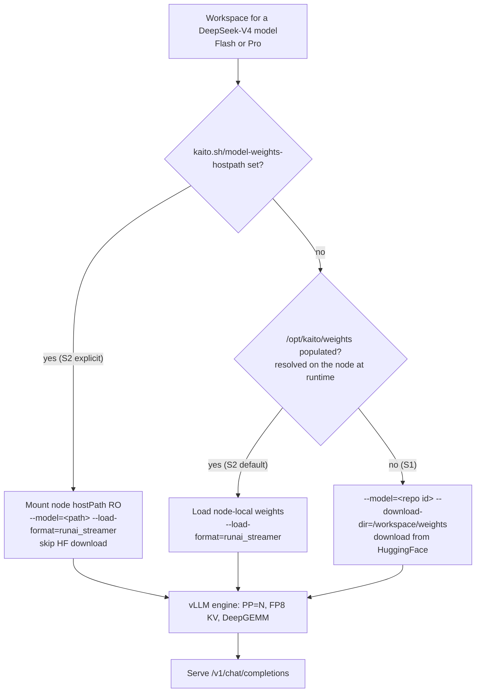

# DeepSeek-V4 Onboarding (Flash & Pro)

Add the DeepSeek-V4 family — `deepseek-ai/DeepSeek-V4-Flash` (284B/13B) and
`deepseek-ai/DeepSeek-V4-Pro` (1.6T/49B) — to KAITO's supported model catalog and
define **two supported paths for delivering their weights to the inference pod**:

- **S1 — download-at-runtime**: pull the weights from HuggingFace at pod startup
  (the standard KAITO preset flow).
- **S2 — node-image weights**: mount weights that are already present on the node
  (baked into a custom GPU node image / VHD) and load them with the RunAI Model
  Streamer.

## Table of Contents

- [DeepSeek-V4 Onboarding (Flash & Pro)](#deepseek-v4-onboarding-flash--pro)
  - [Glossary](#glossary)
  - [Summary](#summary)
  - [Motivation](#motivation)
    - [Goals](#goals)
    - [Non-Goals/Future Work](#non-goalsfuture-work)
  - [Proposal](#proposal)
    - [Runtime Configuration](#runtime-configuration)
    - [DeepGEMM / CUDA toolkit](#deepgemm--cuda-toolkit)
    - [Weight delivery](#weight-delivery)
      - [S1 — Download-at-runtime](#s1--download-at-runtime)
      - [S2 — Node-image weights](#s2--node-image-weights)
    - [Startup-probe timeout](#startup-probe-timeout)
  - [Risks and Mitigations](#risks-and-mitigations)
  - [Alternatives](#alternatives)

## Glossary

| Term | Meaning |
| --- | --- |
| **S1** | Weight delivery by **download-at-runtime** from HuggingFace (`downloadAtRuntime: true`). |
| **S2** | Weight delivery from **node-image weights** baked into the GPU node image, loaded with `--load-format=runai_streamer`. Either explicit (via `kaito.sh/model-weights-hostpath`) or the auto-detected default path `/opt/kaito/weights`. |
| **DeepGEMM** | FP8 block-scaled GEMM library vLLM JIT-compiles with `nvcc` at runtime. |
| **RunAI Model Streamer** | A concurrent, pread-based safetensors loader (`--load-format=runai_streamer`) that avoids the mmap read-ahead cliff on virtualized disks. |
| **PP / TP** | Pipeline / tensor parallelism. |

## Summary

The [DeepSeek-V4](https://huggingface.co/collections/deepseek-ai/deepseek-v4) series
are FP4+FP8 Mixture-of-Experts models with a 1M-token context that share the
`DeepseekV4ForCausalLM` architecture (`model_type: deepseek_v4`). This proposal
onboards two members:

- **DeepSeek-V4-Flash** — 284B total / 13B activated params, ~148.66 GiB of weights.
- **DeepSeek-V4-Pro** — 1.6T total / 49B activated params, 865 GB of weights
  (FP4 experts + FP8).

Two properties make the V4 family harder to onboard than a typical preset:

1. **FP8/FP4 DeepGEMM.** Their E8M0 block-scaled FP8 GEMMs (and FP4 MoE experts)
   require DeepGEMM, which JIT-compiles with `nvcc`. The slim KAITO runtime image
   ships no CUDA toolkit, so a toolkit must be provided to the pod.
2. **Cold-load cost.** Loading hundreds of GiB via the default mmap safetensors
   loader is read-ahead-starved on virtualized OS disks — the first load can take
   tens of minutes to hours.

This proposal standardizes **two weight-delivery strategies (S1 and S2)** so
operators can trade off simplicity (S1) against cold-start latency and network cost
(S2). Both strategies apply to Flash and Pro and differ only in *where the weights
come from*.

## Motivation

The DeepSeek-V4 family are emerging, high-interest open models with strong reasoning
and tool-calling capability (V4-Pro-Max is positioned as a leading open model).
Supporting them lets KAITO users self-host frontier-class models. But their size
makes the default "download from HuggingFace every time" flow (S1) slow and
bandwidth-hungry: pulling ~148 GiB (Flash) — or 865 GB (Pro) — per pod is expensive
and couples startup latency to internet egress, and is impractical for Pro. Operators
running dedicated GPU fleets prefer to bake weights into the node image once (S2) and
load them locally in seconds. KAITO should support both without forking the model
definition.

### Goals

- Register `deepseek-ai/DeepSeek-V4-Flash` and `deepseek-ai/DeepSeek-V4-Pro` in the
  model catalog with a shared runtime configuration that serves correctly (FP8/FP4
  DeepGEMM, 1M context, reasoning + tool parsing) across multi-node pipeline
  parallelism.
- Support **S1** (download-at-runtime) as the zero-infrastructure default.
- Support **S2** (node-image weights) as an opt-in for fast, network-free cold
  starts, using `--load-format=runai_streamer` for concurrent local load.
- Provide DeepGEMM's `nvcc` toolchain to the pod without bloating the base image,
  in a way that is shared across pods on a node and survives pod recreation.
- Keep S1 and S2 selectable purely via Workspace configuration — no per-strategy
  model entries.

### Non-Goals/Future Work

- Blob-storage streaming (`az://` via ModelMirror / RunAI streamer from object
  storage) is a separate, complementary path (see
  [model-mirror](./20260520-model-mirror.md)) and is **not** covered here.
- Prefill/decode disaggregation for V4 (see
  [MultiRoleInference P/D](./20260424-multiroleinference-pd-disaggregation.md)) is
  future work.
- Automatically baking weights into node images (VHD build pipeline) is out of
  scope; S2 assumes the operator has produced such an image.

## Proposal
### Runtime Configuration
V4 requires the following:

| Concern | Setting | Why |
| --- | --- | --- |
| KV cache | `--kv-cache-dtype=fp8` | V4 asserts "only supports fp8 kv-cache format for now". |
| DeepGEMM | `VLLM_USE_DEEP_GEMM=1` | V4's E8M0 block-scaled FP8 (and FP4 expert) GEMMs require DeepGEMM; the CUTLASS fallback fails (`ScalarType 44`). |
| Hybrid KV manager | LMCache CPU offload disabled (`kaito-kv-cache-cpu-memory-utilization=0`) | `DeepseekV4ForCausalLM` needs vLLM's hybrid KV cache manager, incompatible with the LMCache connector. |
| Parsers / tokenizer | `reasoning-parser=deepseek_v4`, `tool-call-parser=deepseek_v4`, `tokenizer_mode=deepseek_v4` | Native V4 reasoning + tool-call formatting. |
| transformers | 5.8.1 in the base image | 5.8.0 is the first release with `DeepseekV4Config`; earlier versions load V4 as a base config and fail tokenizer/config resolution. |

### DeepGEMM / CUDA toolkit

The slim runtime image ships no `nvcc`, but DeepGEMM JIT-compiles at runtime. For
any model that `RequiresDeepGEMM()` (currently the V4 family) KAITO provisions a CUDA
toolkit on the node and points `CUDA_HOME` at it:

- The toolkit lives at a **node hostPath** (default `/opt/kaito/cuda/129`, override
  with `kaito.sh/cuda-toolkit-hostpath`), mounted read-only into the main container.
- A `cuda-toolkit-provisioner` init container installs `cuda-toolkit-12-9` into that
  hostPath if `nvcc` is absent, serialized with `flock` and idempotent (skips when
  already present). Because it is node-scoped, the install **survives pod recreation
  and is shared by all pods on the node** — only cold nodes pay the install.
- The OS version in KAITO base image needs to be pinned to Debian bookworm (glibc 2.36),
  because `nvcc` host-compiles against the container's headers (glibc 2.41 / trixie
  breaks CUDA 12.9's `nvcc`).

### Weight delivery

The **weight source** is selected by Workspace
configuration, resolved through KAITO's model-source logic
(streaming → explicit local → default local → download):



#### S1 — Download-at-runtime

The catalog marks both V4 models `downloadAtRuntime: true`. The pod uses the KAITO
base image; vLLM downloads the weights from HuggingFace into the model-weights volume
(`--download-dir=/workspace/weights`) on first start.

```yaml
apiVersion: kaito.sh/v1beta1
kind: Workspace
metadata:
  name: workspace-deepseek-v4-flash
resource:
  instanceType: Standard_ND96isr_H100_v5   # or a BYO H100 pool
  labelSelector:
    matchLabels:
      apps: deepseek-v4-flash
inference:
  preset:
    name: deepseek-ai/DeepSeek-V4-Flash
```

- **Pros:** zero infrastructure; works on any conformant GPU nodes.
- **Cons:** every cold pod downloads the full weights (~148 GiB Flash, 865 GB Pro);
  startup latency is bound by egress bandwidth; repeated pulls are costly at scale and
  impractical for Pro.
- CUDA toolkit is still provisioned automatically (see above) on the target nodes.

#### S2 — Node-image weights

The operator bakes the weights into a custom GPU node image (VHD) at a known
directory and labels the pool so the Workspace targets it. The Workspace opts in
with `kaito.sh/model-weights-hostpath`; KAITO mounts that host directory read-only,
points `--model` at it, sets `--load-format=runai_streamer`, and **skips the
HuggingFace download entirely**.

```yaml
apiVersion: kaito.sh/v1beta1
kind: Workspace
metadata:
  name: workspace-deepseek-v4-flash
  annotations:
    # weights baked into the node image
    kaito.sh/model-weights-hostpath: /opt/kaito/models/deepseekv4flash
    # optional: reuse a baked CUDA toolkit instead of installing
    kaito.sh/cuda-toolkit-hostpath: /opt/kaito/cuda/129
resource:
  labelSelector:
    matchLabels:
      kaito-workspace: deepseek-v4-flash   # BYO pool with the baked VHD
inference:
  preset:
    name: deepseek-ai/DeepSeek-V4-Flash
```

- **Pros:** no network egress; concurrent local load. Validated at ~17 s to load all
  148 GiB shards on 3× H100 (PP=3) via the RunAI streamer, versus tens of minutes for
  a cold mmap read.
- **Cons:** requires operating a custom node image; the mount uses
  `HostPathDirectory`, so a missing/empty directory fails the pod fast (the operator
  asserts the weights are present).

**Zero-annotation default (`/opt/kaito/weights`).** S2 also works without any
annotation. Every vLLM preset pod mounts the conventional node directory
`/opt/kaito/weights` read-only (`DirectoryOrCreate`, so pods still start on nodes
that lack it), and the entrypoint resolves the model source **at runtime**: if that
directory holds a model (a `config.json` plus a safetensors/bin/pt file) it loads
from there with `runai_streamer`; otherwise it falls back to the configured source
(S1 download, or image-baked weights). This lets an operator bake weights at the
well-known path and get S2 behavior with an **unmodified Workspace**, while any node
lacking them degrades gracefully to S1.

Precedence — resolved as streaming → explicit local → default local → download:

1. `kaito.sh/model-weights-hostpath` (explicit): the controller sets `--model` to it
   directly and mounts `HostPathDirectory` (fail-fast if absent). No runtime check.
2. `/opt/kaito/weights` (default): mounted on every vLLM pod and passed as
   `--kaito-local-weights-dir`; the entrypoint uses it **only if populated**.
3. Otherwise the model is downloaded from HuggingFace (S1).

### Startup-probe timeout

Because V4 models are large, the startup-probe timeout scales with model weight size
(`readinessTimeoutForModelSize`): `15 min base + size × 18 s/GiB`, clamped to
`[30 min, 180 min]`. V4-Flash (~148 GiB) resolves to ~59 min; V4-Pro (865 GB) hits
the 180 min cap. This covers the S1 download plus engine init, CUDA-graph capture,
and the optional post-load benchmark; S2 finishes far sooner but uses the same
ceiling.

## Risks and Mitigations

- **DeepGEMM JIT needs `nvcc` (both strategies).** *Mitigation:* node-persistent
  CUDA toolkit hostPath + `cuda-toolkit-provisioner`, and a bookworm base image with
  `g++`.
- **S2 hostPath is restricted by Pod Security Admission.** Mounting host paths may be
  blocked under the `restricted` PSA profile. *Mitigation:* S2 is opt-in; clusters
  enforcing `restricted` use S1 (or grant an exception for the dedicated pool).
- **S2 weights missing/at wrong path.** *Mitigation:* `HostPathDirectory` mount fails
  the pod fast with a clear `FailedMount`, surfacing the operator's mistake
  immediately rather than silently downloading.

## Alternatives
- **Baking `nvcc` into the base image.** Rejected: adds multiple GiB to every KAITO
  image for a single-model need; the node-persistent hostPath install pays the cost
  once per node only when DeepGEMM is required.
- **Blob-storage streaming (`az://` via ModelMirror).** Streams weights from object
  storage with the RunAI streamer. Complementary to S1/S2; deferred to the model-mirror
  proposal. S2 was chosen here because dedicated fleets already bake node images and
  want zero external dependency at pod start.
