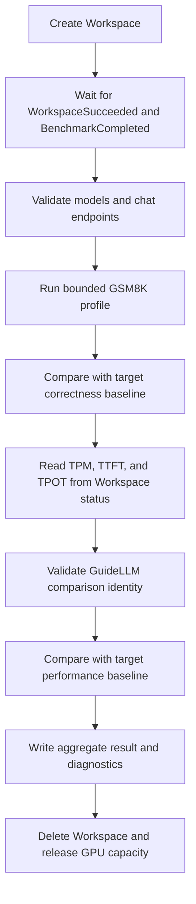

# Preset Regression Correctness and Performance Verification

## Summary

Extend the preset model regression workflows from deployment validation into model correctness and serving performance regression tests.

After each model reaches `WorkspaceSucceeded=True` and `BenchmarkCompleted=True`, the regression runner will:

1. run a bounded, deterministic GSM8K evaluation against the deployed OpenAI-compatible endpoint and compare exact-match accuracy with a baseline for the same regression target; and
2. read TPM, TTFT, and TPOT from `status.performance.metrics`, which are already produced by the startup GuideLLM benchmark, and compare them with baselines for the same model, GPU SKU, and topology.

Benchmark definitions and baseline results become separate, reviewed repository data:

- `benchmarks/gsm8k/config.yaml` stores correctness benchmark profiles, the default profile, and model-specific overrides;
- `benchmarks/gsm8k/baselines.yaml` stores correctness results by regression target;
- `benchmarks/guidellm/config.yaml` stores startup benchmark profiles, the default profile, and metric definitions; and
- `benchmarks/guidellm/baselines.yaml` stores TPM, TTFT, and TPOT results by deployment target.

Every runnable target emitted by `.github/scripts/preset-regression-tests/preset-regression-matrix.sh` must eventually have both a GSM8K baseline and a GuideLLM baseline. Missing or incomparable baselines are reported distinctly from benchmark regressions.

## Motivation

The existing preset regression workflows answer whether a model can be deployed and serve requests on supported GPU pools. They validate:

- resource and inference readiness;
- successful completion of the startup benchmark;
- positive startup benchmark metrics;
- `/v1/models`; and
- `/v1/chat/completions`.

Those checks do not detect two important classes of regression:

- **Correctness regression:** a model loads and returns HTTP 200, but a parser, chat template, quantization kernel, dtype, runtime flag, or model implementation causes wrong or empty output.
- **Performance regression:** a model remains correct, but a runtime, kernel, scheduling, cache, or parallelism change materially reduces throughput or increases request latency.

KAITO already pays the cost of deploying each catalog model and running a post-load GuideLLM stress test. Reusing that deployment for a short correctness canary and comparing the already-recorded throughput and latency adds stronger release confidence with limited additional GPU time.

## Benchmark selection

### Why GSM8K for correctness

GSM8K provides deterministic, self-scored answers with no external judge. A fixed 128-question subset with greedy decoding completes in less than ten minutes per model while still detecting broad output corruption, empty responses, chat-template regressions, and reasoning-parser failures. Its exact-match score is straightforward to reproduce and compare with a reviewed baseline.

MMLU measures broad factual and academic knowledge across many subjects, but its multiple-choice format exercises less of the generated-answer path. A model can preserve answer selection while regressing in chat formatting, multi-step generation, reasoning output, or final-answer extraction. MMLU is valuable for broader capability tracking, while GSM8K is more sensitive to the serving and parsing failures this regression suite is intended to catch.

MT-Bench measures conversational quality, but it is a poor fit for a per-target regression gate. It is slower, requires a separate judge model and credentials, and introduces judge-version and scoring variability that can obscure whether the deployed model changed. MT-Bench remains useful for model onboarding and deeper quality assessment.

GSM8K does not replace either benchmark. It is selected as a narrow, reproducible correctness canary rather than a public leaderboard score or comprehensive capability measure.

### Why GuideLLM for performance

KAITO already runs GuideLLM after model loading and warmup against the same endpoint and serving configuration customers receive. That benchmark supplies throughput, time to first token, and time per output token under a high-concurrency workload. Reading its TPM, TTFT, and TPOT results adds no second load test and little additional GPU time.

Running another performance suite would lengthen every target run and duplicate load generation. Running it before GSM8K could perturb correctness evaluation, while running it afterward would delay teardown and hold GPU capacity longer. Reusing the startup GuideLLM result instead measures the actual KAITO-selected parallelism and cache capacity while preserving the existing deployment, diagnostics, teardown, and non-fail-fast workflow behavior.

## Benchmark repository layout

Add the following files:

```text
benchmarks/
  gsm8k/
    README.md
    config.yaml
    baselines.yaml
  guidellm/
    README.md
    config.yaml
    baselines.yaml
```

The README files document collection commands, schema versions, profile semantics, and the update process. Configuration and baseline manifests are hand-reviewable YAML and are validated by deterministic tooling.

Benchmark configuration and baseline data do not belong in `.github/preset-regression-config.json`; that file remains limited to infrastructure and target-matrix policy. Benchmark `config.yaml` files own reproducibility-critical identity, profiles, execution limits, and comparison policy. Baseline manifests contain measured reference results only.

### Regression execution policy

Operational settings and comparison tolerances belong to each benchmark's `config.yaml`, rather than to the shared regression infrastructure or a baseline manifest:

```yaml
execution:
  numConcurrent: 4
  requestTimeoutSeconds: 300
  timeoutSeconds: 1200
  maxRetries: 3
comparison:
  defaultMaxRegression: 0.05
  maxRegressionOverrides: {}
  requireBaselines: false
```

These values control runner resource use, failure deadlines, and gating policy. A reviewed override is keyed by complete regression-target identity; baseline result entries never contain tolerances.

## GSM8K configuration schema

`benchmarks/gsm8k/config.yaml` defines the benchmark identity, reusable evaluation profiles, a default profile, and sparse model-specific overrides.

```yaml
schemaVersion: 1
benchmark:
  dataset: openai/gsm8k
  datasetRevision: <pinned-dataset-revision>
  split: test
  evaluator: lm-eval
  evaluatorVersion: 0.4.13
  task: gsm8k
  metric: exact_match,flexible-extract
  sampleSelection:
    strategy: first
    count: 128
  defaultProfile: chat-thinking-v1

profiles:
  chat-nonthinking-v1:
    applyChatTemplate: true
    fewshotAsMultiturn: false
    temperature: 0
    maxGenTokens: 512
    stopSequences:
      - "</s>"
      - "<|im_end|>"
  chat-thinking-v1:
    applyChatTemplate: true
    fewshotAsMultiturn: false
    temperature: 0
    maxGenTokens: 8192
    chatTemplateKwargs:
      enable_thinking: true
    stopSequences:
      - "</s>"
      - "<|im_end|>"
  mistral-thinking-v1:
    applyChatTemplate: true
    fewshotAsMultiturn: false
    temperature: 0
    maxGenTokens: 8192
    requestKwargs:
      reasoning_effort: high
    stopSequences:
      - "</s>"
      - "<|im_end|>"

modelProfileOverrides:
  "<model-rejecting-thinking-controls>": chat-nonthinking-v1

modelExecutionOverrides:
  "<slow-model>":
    numConcurrent: 8
```

Models absent from `modelProfileOverrides` use `chat-thinking-v1`. `chat-nonthinking-v1` omits thinking controls for tokenizers that reject them. `modelExecutionOverrides` can change bounded runtime settings such as concurrency without changing the generation profile. Changing benchmark identity or `defaultProfile` requires recollecting all affected defaulted baselines. Changing a profile definition or one model override requires recollecting only baselines that resolve to the changed profile. Runtime limits and tolerance changes do not.

`requestKwargs` contains top-level OpenAI chat-completion request fields. Mistral
tokenizers reject Hugging Face-style `chat_template_kwargs`, so reasoning is
enabled through the native `reasoning_effort: high` field instead.

## GSM8K baseline results schema

`benchmarks/gsm8k/baselines.yaml` contains measured results keyed by regression-target identity:

```yaml
schemaVersion: 1
targets:
  - model: google/gemma-4-E2B-it
    instanceType: Standard_NC40ads_H100_v5
    nodes: 1
    profile: chat-thinking-v1
    accuracy: 0.84375
    correct: 108
    evaluated: 128
    emptyResponses: 0
    measuredAt: "2026-09-21"
```

`profile` records the effective profile selected when the baseline was measured. It must name a defined profile and match the profile currently resolved for the model by `defaultProfile` and `modelProfileOverrides`. `accuracy` must equal `correct / evaluated`, `evaluated` must match the sample count in `benchmarks/gsm8k/config.yaml`, and `emptyResponses` records how many evaluated samples produced no final content. Storing the profile, numerator, and empty-response count makes profile drift, accidental rounding, denominator changes, and reasoning-budget exhaustion visible in review.

An empty final response is retained as an `empty-response` failed sample and
contributes zero to accuracy. It does not invalidate the rest of the run, so a
reviewed baseline can include models that exhaust their generation budget on a
small number of ambiguous samples.

The comparison is an absolute accuracy floor:

$$
\text{minimumAccuracy} = \max(0, \text{baselineAccuracy} - \text{maxRegression})
$$

A candidate passes when its accuracy is at least `minimumAccuracy`. Improvements do not fail. The initial default tolerance is five percentage points; individual targets may use a reviewed override from `benchmarks/gsm8k/config.yaml`.

Because the same examples and greedy decoding are used on every run, this threshold protects against deterministic output drift rather than compensating for random sample selection. Any profile, evaluator, dataset revision, or sample-selection change creates a new baseline contract and requires recollection.

## GuideLLM configuration schema

`benchmarks/guidellm/config.yaml` defines named startup benchmark profiles and the metric definitions used to determine whether a measurement is comparable:

```yaml
schemaVersion: 1
benchmark:
  defaultProfile: stress-high-concurrency-v1
  metrics:
    peakTokensPerMinute:
      unit: tokens/min
      better: higher
    averageTimeToFirstToken:
      unit: ms
      better: lower
    averageTimePerOutputToken:
      unit: ms
      better: lower

profiles:
  stress-high-concurrency-v1:
    description: stress/high-concurrency
    durationSec: 60
    inputTokens: 2048
    outputTokens: 256
```

All targets initially use `stress-high-concurrency-v1`. The selected profile's description, duration, input length, and output length must match the configuration reported by the startup benchmark. Changing `defaultProfile` or a profile definition requires recollecting every affected baseline.

Serving performance is not a model-only property. It depends on GPU SKU, GPUs per node, node count, parallelism, quantization, runtime, and benchmark shape. GuideLLM baseline results therefore correspond to regression matrix targets, not just catalog names.

## GuideLLM baseline results schema

`benchmarks/guidellm/baselines.yaml` contains target identity and exactly three measured baseline values:

```yaml
schemaVersion: 1

targets:
  - model: google/gemma-4-E2B-it
    instanceType: Standard_NC40ads_H100_v5
    nodes: 1
    profile: stress-high-concurrency-v1
    tpm: 2178000
    ttftMs: 237.2
    tpotMs: 18.4
```

`profile` records the effective GuideLLM profile selected when the baseline was measured. It must name a defined profile and match the startup benchmark configuration. The three measured values are copied from one valid startup benchmark result. Raw benchmark output and runtime metadata remain in workflow artifacts rather than the baseline manifest.

TPM uses a relative floor:

$$
TPM_{min} = TPM_{baseline}(1 - r_{TPM})
$$

TTFT and TPOT use relative ceilings because lower latency is better:

$$
TTFT_{max} = TTFT_{baseline}(1 + r_{TTFT})
$$

$$
TPOT_{max} = TPOT_{baseline}(1 + r_{TPOT})
$$

The initial defaults allow a 15 percent TPM drop, 20 percent TTFT increase, and 15 percent TPOT increase. TTFT receives wider tolerance because queueing and first-request effects are noisier than steady-state token generation. A target-specific override lives in `.github/preset-regression-config.json` and requires measured evidence in review. A candidate must pass all three bounds; improvement in one metric does not compensate for regression in another.

### Performance comparison identity

The following fields must match before comparing performance:

- model name;
- exact instance type;
- actual node count;
- the profile stored in the baseline; and
- the selected profile's description, duration, input length, and output length, which must match the startup benchmark configuration.

Runtime metadata and `maxConcurrency` remain in raw workflow artifacts and reports for diagnosis, but are not stored in or used to select a baseline.

If the estimator changes actual node count, the candidate is not comparable with the existing target. The run fails with `baseline configuration mismatch` rather than making a misleading throughput comparison. An intended topology change requires collecting and reviewing a new target baseline.

## Baseline coverage

Add unit tests that compute two expected sets:

1. **Correctness coverage:** every non-blocked target emitted by `preset-regression-matrix.sh` must have one GSM8K target entry.
2. **Performance coverage:** the same generated target set must have one GuideLLM target entry.

The tests reject:

- missing matrix targets;
- unknown model names;
- duplicate identities;
- stale entries for models no longer in the catalog, unless explicitly archived outside the active manifest;
- invalid scores, tolerances, or units; and
- references to undefined correctness or performance profiles.

During rollout, incomplete coverage may be reported without failing candidate model runs. At the end of rollout, coverage becomes required. New model onboarding is not complete until both baseline requirements are satisfied for every target generated for that model.

Exceptional models may have a temporary exemption only when the repository cannot evaluate them. Exemptions must include a reason, owner, tracking issue, and expiration date; they are not represented as fabricated zero or `N/A` scores.

## Regression workflow

For each matrix target, the runner performs the following sequence:



The runner never starts a second GuideLLM load. It reads the value and configuration already accepted by `BenchmarkCompleted=True`.

The aggregate result records at least:

```json
{
  "model": "google/gemma-4-E2B-it",
  "correctness": {
    "status": "passed",
    "profile": "chat-thinking-v1",
    "accuracy": 0.84375,
    "baselineAccuracy": 0.84375,
    "minimumAccuracy": 0.79375,
    "correct": 108,
    "evaluated": 128,
    "emptyResponses": 0,
    "durationSeconds": 57.3
  },
  "performance": {
    "status": "passed",
    "profile": "stress-high-concurrency-v1",
    "peakTokensPerMinute": 2170000,
    "baselinePeakTokensPerMinute": 2178000,
    "minimumPeakTokensPerMinute": 1851300,
    "averageTimeToFirstToken": 239.1,
    "baselineAverageTimeToFirstToken": 237.2,
    "maximumAverageTimeToFirstToken": 284.64,
    "averageTimePerOutputToken": 18.6,
    "baselineAverageTimePerOutputToken": 18.4,
    "maximumAverageTimePerOutputToken": 21.16,
    "maxConcurrency": 1024,
    "durationSec": 60,
    "inputTokens": 2048,
    "outputTokens": 256
  }
}
```

Failed runs retain raw evaluator output, Workspace YAML/status, pod logs, and baseline-comparison details in the existing artifact directory. Successful runs may retain only aggregate values to limit artifact size.

## Comparison with vLLM regression testing

vLLM runs nightly correctness and performance suites for the inference runtime itself. KAITO adopts the same broad separation between correctness and performance, but applies it to deployed preset targets and uses shorter workloads with repository-reviewed gates.

| Area | vLLM nightly strategy | KAITO preset regression strategy |
|---|---|---|
| Primary purpose | Detect runtime and kernel regressions across vLLM models and configurations. | Detect end-to-end regressions in KAITO presets, deployment topology, serving configuration, and model output. |
| GSM8K evaluator | Dedicated evaluator under `tests/evals/gsm8k`, designed for direct control and throughput. | Pinned `lm-eval` using the deployed OpenAI-compatible chat endpoint. |
| GSM8K workload | Full 1,319-question test set by default, five-shot prompting, greedy decoding, and a fixed seed. | Fixed 128-question subset, five-shot prompting, greedy decoding, and named thinking or non-thinking profiles. |
| Prompt path | Completion-oriented evaluation without KAITO-specific thinking profiles. | Chat-template path used by deployed Workspaces, including reasoning-parser and final-answer handling. |
| Performance coverage | Separate startup, latency, offline throughput, and online serving benchmarks across a broad matrix. | Reuses the existing startup GuideLLM high-concurrency result; no second performance workload is launched. |
| Result tracking | Publishes historical measurements for dashboards and trend analysis; performance runs are primarily observational. | Stores reviewed baselines per `(model, instanceType, nodes, profile)` and enforces explicit TPM, TTFT, TPOT, and accuracy bounds. |
| Cadence and cost | Nightly deep coverage with a larger runtime-focused test budget. | Runs for preset regression targets and keeps the added correctness phase below ten minutes per deployment. |

The KAITO suite therefore complements vLLM's coverage. vLLM is better positioned to identify low-level runtime regressions across a broad benchmark matrix, while KAITO verifies that a specific model preset still deploys on its supported hardware, serves through the expected API path, preserves correctness, and remains within target-specific performance bounds.
