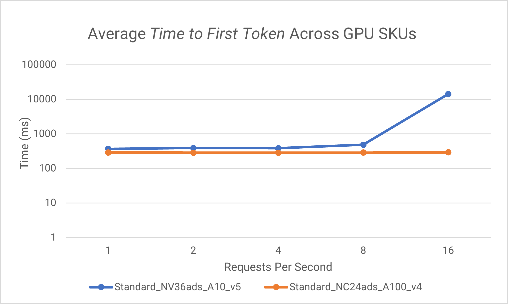
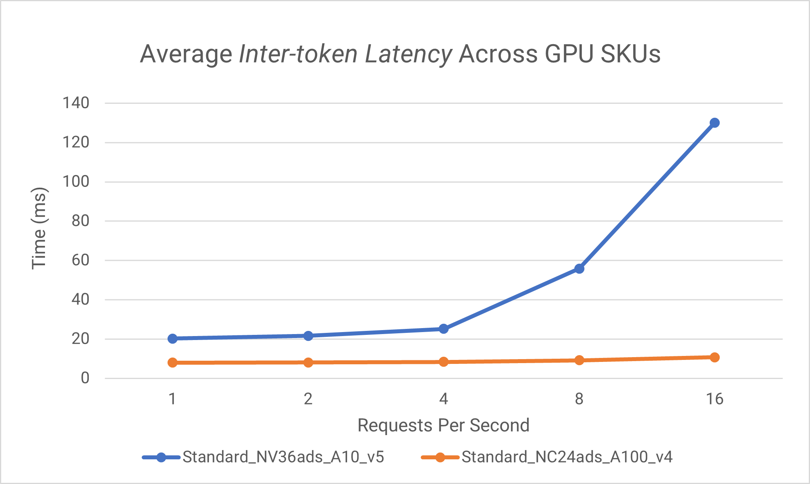

These benchmarks help users choose the optimal GPU SKU for running their AI models with Kaito. We compare performance characteristics across different Azure GPU instance types to guide cost-effective hardware selection.

## Test Setup

We built a cluster with Kaito and a single GPU node (without node auto-provisioning). The following Azure GPU instance types were used to represent a small and medium size node. 

- Standard_NV36ads_A10_v5: 1x NVIDIA A10 GPU (24GB VRAM)
- Standard_NC24ads_A100_v4: 1x NVIDIA A100 GPU (80GB VRAM)

A Kaito workspace was created with the `phi-4-mini-instruct` model and `max-model-len = 50000` in the inference config map. 

:::note
More models will be added in the future
:::

Then, the benchmarks were conducted using [GuideLLM](https://github.com/neuralmagic/guidellm) and the `phi-4-mini-instruct` model. GuideLLM was configured with the following parameters:

 - Prompt tokens: 200
 - Output tokens: 200
 - Poisson distribution at 1, 2, 4, 8, 16 requests per second

An example of how to run the benchmark:

```bash
export RATE="16"
guidellm benchmark \
  --target "http://127.0.0.1:8000" \
  --rate-type poisson \
  --rate "$RATE" \
  --data "prompt_tokens=200,output_tokens=200" \
  --model phi-4-mini-instruct \
  --processor microsoft/phi-4-mini-instruct \
  --output-path="./benchmark-phi4-p$RATE.csv"
```

## Benchmark Results

### Time to First Token (TTFT) Comparison



The A10 GPU shows good performance for moderate workloads but begins to struggle under high concurrent load, particularly at 16 requests per second, where the latency spikes from 480 ms to 14 seconds.

The A100, on the other hand, maintains consistent latency as the requests per second increase, meaning it has more than enough bandwith to run this model. And since no performance degredation was observed, it is likely overpowered for this workload.

### Inter-Token Latency (ITL) Comparison  



The A10 GPU shows an exponential increase in ITL as the request rate increases, indicating that it struggles to keep up with the demands of higher concurrency.

The A100, again shows a minimal increase in ITL as the request rate increases, demonstrating that it is more than powerful enough to run this model and can likely handle even greater loads without issue.
