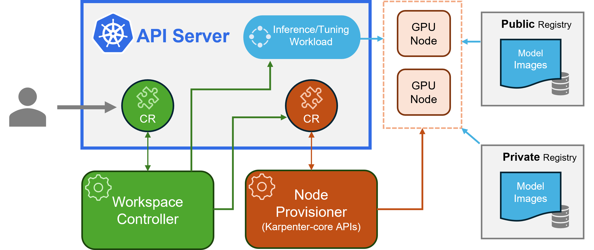

:::info What's NEW!
**Coming soon:** Kaito v0.5.0. Retrieval-augmented generation (RAG) - RagEngine support with LlamaIndex orchestration and Faiss as the default vectorDB, learn about recent updates [here](https://github.com/kaito-project/kaito/issues/734)!

**Latest Release:** May 14th, 2025. Kaito v0.4.6.

**First Release:** Nov 15th, 2023. Kaito v0.1.0.
:::

Kaito is an operator that automates the AI/ML model inference or tuning workload in a Kubernetes cluster.
The target models are popular open-sourced large models such as [falcon](https://huggingface.co/tiiuae) and [phi-3](https://huggingface.co/docs/transformers/main/en/model_doc/phi3).

## Key Features

Kaito has the following key differentiations compared to most of the mainstream model deployment methodologies built on top of virtual machine infrastructures:

- **Container-based Model Management**: Manage large model files using container images with an OpenAI-compatible server for inference calls
- **Preset Configurations**: Avoid adjusting workload parameters based on GPU hardware with built-in configurations
- **Multiple Runtime Support**: Support for popular inference runtimes including [vLLM](https://github.com/vllm-project/vllm) and [transformers](https://github.com/huggingface/transformers)
- **Auto-provisioning**: Automatically provision GPU nodes based on model requirements
- **Public Registry**: Host large model images in the public Microsoft Container Registry (MCR) when licenses allow

Using Kaito, the workflow of onboarding large AI inference models in Kubernetes is largely simplified.

## Architecture

Kaito follows the classic Kubernetes Custom Resource Definition(CRD)/controller design pattern. Users manage a `workspace` custom resource which describes the GPU requirements and the inference or tuning specification. Kaito controllers automate the deployment by reconciling the `workspace` custom resource.

The above figure presents the Kaito architecture overview. Its major components consist of:

- **Workspace controller**: Reconciles the `workspace` custom resource, creates `machine` custom resources to trigger node auto provisioning, and creates the inference or tuning workload (`deployment`, `statefulset` or `job`) based on the model preset configurations.
- **Node provisioner controller**: The controller's name is *gpu-provisioner* in [gpu-provisioner helm chart](https://github.com/Azure/gpu-provisioner/tree/main/charts/gpu-provisioner). It uses the `machine` CRD originated from [Karpenter](https://sigs.k8s.io/karpenter) to interact with the workspace controller. It integrates with Azure Resource Manager REST APIs to add new GPU nodes to the AKS or AKS Arc cluster.

:::note
The [*gpu-provisioner*](https://github.com/Azure/gpu-provisioner) is an open sourced component. It can be replaced by other controllers if they support [Karpenter-core](https://sigs.k8s.io/karpenter) APIs.
:::

## Getting Started

👉 To get started, please see the [Installation Guide](installation)!

👉 For a quick start tutorial, check out [Quick Start](quick-start)!

## Community

- **GitHub**: [kaito-project/kaito](https://github.com/kaito-project/kaito)
- **Slack**: [Join our community](https://join.slack.com/t/kaito-z6a6575/shared_invite/zt-2wm17rttz-t4E6_rMIuY03DwBHaJq1sg)
- **Email**: [kaito-dev@microsoft.com](mailto:kaito-dev@microsoft.com)
