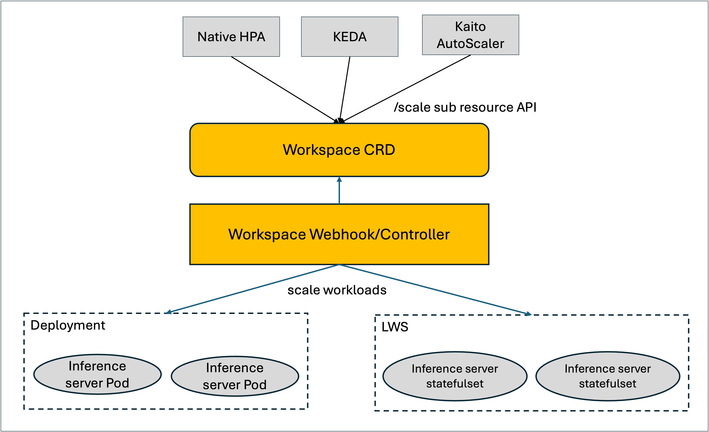
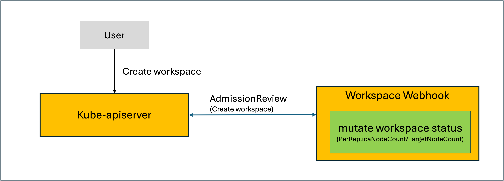
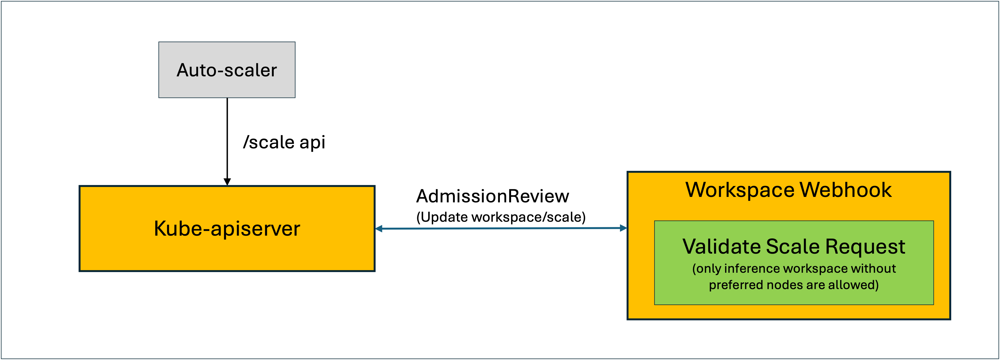
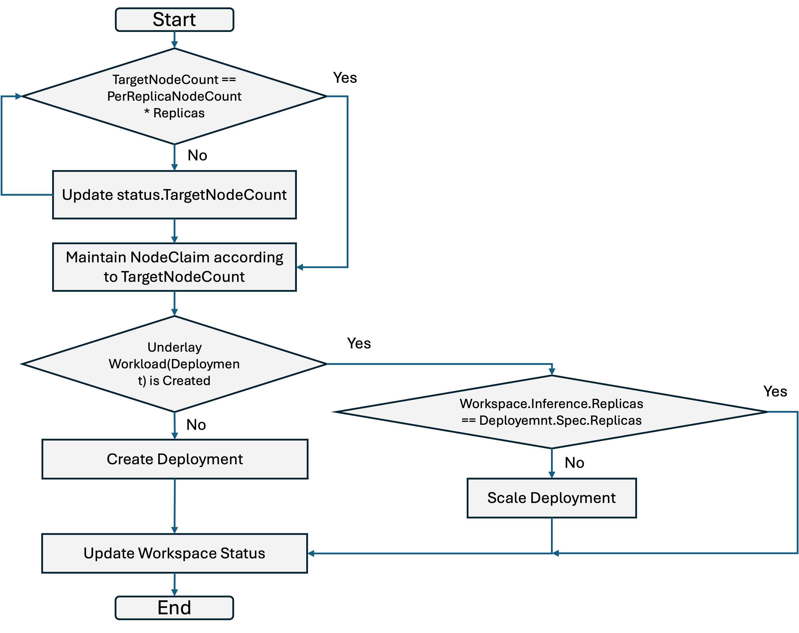

# Title

Support scale subresource api for workspace in kaito

## Summary

As the number of waiting inference requests increase, It is necessary to scale more inference instances in order to preventing to block inference requests. on the other hand, If the number of waiting inference requests declines, we should consider to reduce inference instances for improving gpu resource utilization.

We hope to provide an auto-scaler feature for scaling inference workloads automatically in terms of changes of custom metrics from inference pods, and this auto scaler doesn't depend on other components(this means Kaito is a self-contained component without dependencies). and we will divide this auto-scaler feature into two parts as following:

- Part one: support scale subresource api for workspace, so different auto-scaler solutions such as KEDA, HPA, etc. can be integrated with Kaito to mamage inference workloads dynamically. This part is addressed in this proposal.
- Part two: support a customized auto-sacler for kaito. The auto-scaler is designed for a minimalistic configuration experience, with most parameters pre-tuned for optimal performance. This allows users to easily get started without requiring specialized knowledge of LLM. This part will be addressed in another proposal. 

## Motivation

LLM inference service is a baisc and widly-used feature in Kaito, and Kaito community interest in auto scaler for inference workloads continues to intensify, related issues: [#306](https://github.com/kaito-project/kaito/issues/306), [#1104](https://github.com/kaito-project/kaito/issues/1104).

From the technical perspective, It's a good idea to provide auto-scaler capability, becasue the auto-scaler of inference workloads dynamically adjusts the number of inference instances based on request volume--scaling up during traffic spikes to improve inference speed, and scaling down during low demand to minimize GPU resource waste.

To ensure different auto-scaler solutions can integrate with Kaito to manage inference workloads dynamically, We aim to support scale subresource API for Workspace CRD in kaito.

### Goals

- Support scale subresource api for workspace CRD.
- Deployment as the underlay workload of Workspace is supported for scaling inference pods.

### Non-Goals/Future Work

- Scaling distributed inference workloads will be supported after LWS is adopted to manage distributed inference in Kaito.
- This proposal will not cover the details of [new gpu nodes estimator](https://github.com/kaito-project/kaito/issues/1178).

## Proposal

### Scale SubResource API Workflow

Workspace CRD will support scale subresource API, so different auto-scaler solutions can adjust Workspace replicas dynamically. and Workspace controller/webhook will update the underlay workloads(like Deployment, LWS, etc.) which are used for managing inference workloads. The detailed workflow is shown in the following figure:



- Workspace CRD: upgrade workspace CRD for supporting scale subresource api.

- Workspace webhook: initialize workspace status for workspace create request.

- Workspace controller: provide the number of gpu nodes and scale underlay workload(Deployment) according to the change of replicas of Workspace.


### Workspace CRD API Change

- Imporove fields realated inference:
  - `spec.Inference`:
    - `spec.Inference.Replicas` field is added for scale subresource api.
    - response of GET scale request will be constructed by using this field.

  - `status.Inference`
    - A new struct named `InferenceStatus` is added for storing status for inference workloads.
    - `status.Inference.Replicas`:
      - the value is populated by workspace controller according to the changes of `Deployment.Status.Replicas` or `LWS.Status.Replicas`
      - the construction of response of GET scale request will also use this field.
    - `status.Inference.PerReplicaNodeCount`:
      - used for recording the number of gpu nodes for one replica of inference workload.
      - the value is calculated by new gpu nodes estimator according to the sku and preset parameters.
      - the value is populated by the workspace webhook for workspace create request, and the value will remain constant throughout this workspace's entire lifecycle.
    - `status.Inference.TargetNodeCount`:
      - used for recording the total number of gpu nodes for this workspace, the value should be: `PerReplicaNodeCount * spec.Inference.Replicas`.
      - the initial value for `TargetNodeCount` populated by the workspace webhook for workspace create request.
      - `TargetNodeCount` will be updated in workspace controller when `spec.Inference.Replicas` is changed because of scale action.
      - workspace controller should maintain the number of nodeclaim resources according to this field.

- Deprecate `spec.Resource.Count` field
  - `spec.Resource.Count` is used for estimating the limit gpu nodes for the inference pods by users. There are two reasons to deprecate this field.
  - Reason 1: if scale subresource api is supported, the total number of gpu nodes maybe exceeds this value. that means this field has conflict with scale feature.
  - Reason 2: [A new gpu nodes estimator](https://github.com/kaito-project/kaito/issues/1178) for LLM pod will be supported, so there is no need to estimate the number of gpu nodes by user.

```
// +kubebuilder:subresource:scale:specpath=.spec.inference.replicas,statuspath=.status.inference.replicas
type Workspace struct {
  ...
  Resource ResourceSpec{
    Count *int // deprecate this field
    ...
  }
  Inference InferenceSpec{
    // Number of desired inference workloads, Default value is 1.
    Replicas int32
    ...
  }
  Status WorkspaceStatus{
    Inference *InferenceStatus
    ...
  }
}

type InferenceStatus struct {
    // Total number of running inference workloads of this workspace.
    Replicas int32

    // PerReplicaNodeCount is used for recording the number of gpu nodes for one replica of workspace workload. 
    PerReplicaNodeCount int32

    // TargetNodeCount is used for recording the total number of gpu nodes for the workspace.
    TargetNodeCount int32
}
```

### Workspace Webhook

Workspace webhook should be improved for initializing workspace status and validate scale request is allowed or not.



- gpu nodes estimator will be used to calculate the `PerReplicaNodeCount` for workspace.



- For workspace without inference settings or workspace with prefered nodes, the scale request will be rejected.

### Workspace Controller

The workspace controller should reconcile TargetNodeCount in order to keep consistent with scaling action. then scale underlay workloads(Deployment) and update workspace status. The workflow should be improved as following:



### Workspace CRD Subresource Change

recommend to use kubebuilder annotation to update CRD.

```
apiVersion: apiextensions.k8s.io/v1
kind: CustomResourceDefinition
metadata:
  annotations:
    controller-gen.kubebuilder.io/version: v0.15.0
  name: workspaces.kaito.sh
spec:
spec:
  group: kaito.sh
  names:
    categories:
    - workspace
    kind: Workspace
    listKind: WorkspaceList
    plural: workspaces
    shortNames:
    - wk
    - wks
    singular: workspace
  scope: Namespaced
  versions:
  ...
    served: true
    storage: true
    subresources:
      scale: # new added
        specReplicasPath: .spec.inference.replicas
        statusReplicasPath: .status.inference.replicas
      status: {}
```

## Implementation History
- [ ] 06/10/2025: Open proposal PR
