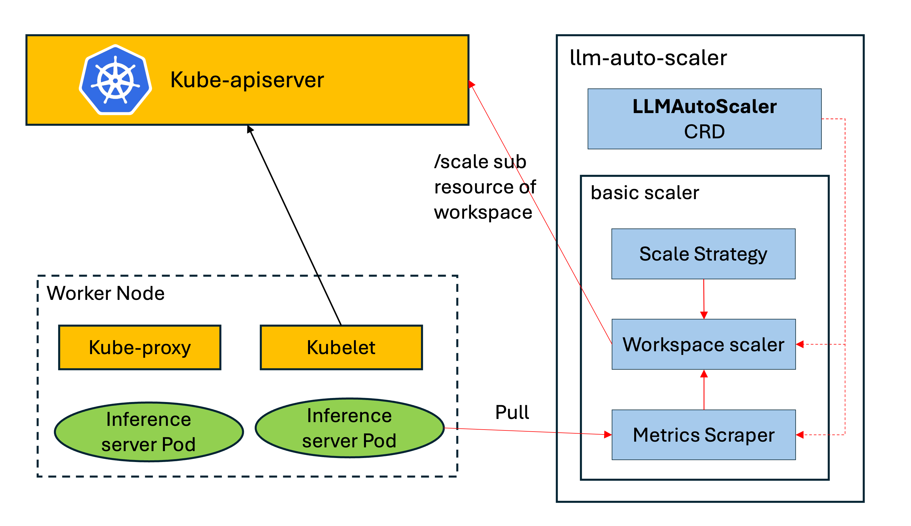

# Title

Auto Scaler for inference workloads in Kaito

## Summary

As the number of waiting inference requests increase, It is necessary to scale more inference instances in order to preventing to block inference requests. on the other hand, If the number of waiting inference requests declines, we should consider to reduce inference instances for improving gpu resource utilization.
Native Kubernetes has provided HPA capability to scale workload instance automatically as the metrics change. but HPA depends the third-party components(like prometheus, prometheus-adapter, etc.) to collect custom metrics from the source pods.

In this proposal, we hope to support a customized auto-sacler which is specialized for scaling GPU worklods for kaito. The auto-scaler is designed for a minimalistic configuration experience, with most parameters pre-tuned for optimal performance. This allows users to easily get started without requiring specialized knowledge of LLM.

## Motivation

LLM inference service is a baisc and widly-used feature in Kaito, and Kaito community interest in auto scaler for inference workloads continues to intensify, related issues: [#306](https://github.com/kaito-project/kaito/issues/306), [#1104](https://github.com/kaito-project/kaito/issues/1104).

From the technical perspective, It's a good idea to provide auto-scaler capability, becasue the auto-scaler of inference workloads dynamically adjusts the number of inference instances based on request volume--scaling up during traffic spikes to improve inference speed, and scaling down during low demand to minimize GPU resource waste.

To ensure ease of use, The specialized auto-scaler is hosted in a independent repo(kaito-project/llm-auto-scaler). at the same time, the llm-auto-scaler component can work with kaito without depending on any third-party components. 

### Goals

- llm-auto-scaler is a specialized auto-scaler for scaling gpu workloads automatically, and can integrate with kaito to work.
- It is flexible to support mulitple scale strategies, and only one basic scale strategy(scaling workloads according to metrics change) is supported in the first version.

### Non-Goals/Future Work

- Support cron scale strategy(like cron job) for llm-auto-sacler in future version.
- Only support to configure one metric for basic scale strategy, mutiple metrics will be supported in future version.
- scale subresource api for workspace CRD is not covered in this proposal.
- The time efficiency of the auto-scaler is not within the scope of this proposal, as it is influenced by mutliple external factors, including GPU node provisioning, LLM image pulling, etc.

## Proposal

### Auto-Scaler Architecture

The llm-auto-scaler component scrapes metrics from inference pod according to configurations in LLMAutoScaler CRD, and scaler controller calculate desired replicas by integrating scraped metrics and scale strategy,
then scale workspace replicas through /scale subresource API. The detailed auto-scaler architecture is shown in the following figure:



- LLMAutoScaler CRD: is used as auto-scaler configuration(including scale strategy, target reference, etc.) for specified workspace resource.
- Metrics Scraper: a module in auto-scaler of llm-auto-scaler and used for scraping metrics from inference pod.
- Scale Strategy: is used to specify scaler, like basic scaler, cron scaler. different scaler have different algorithm to calculate desired replicas. In this proposal, only basic scaler will be supported. and more strategies will be supported in future versions.
- Scaler Controller: is used for integrating metrics scraper and scaler strategy, also including invoke scale subresource API of workspace.

### LLMAutoScaler CRD

```
type ProtocolType string

const (
	HTTP  ProtocolType = "http"
	HTTPS ProtocolType = "https"
)

// MetricIdentifier defines the way to fetch the specific metric
type MetricIdentifier struct {
	// Name identifies the specific metric to monitor.
	// If unset, vllm:num_requests_waiting will be used.
	Name string

	// selector is the string-encoded form of a standard kubernetes label selector for the given metric.
	// if unset, a selector related to ScaleTargetRef will be configured(like workspace specified labels).
	Selector *metav1.LabelSelector

	// Protocol specify the protocol for accessing pods, http and https are supported.
	// if unset, http will be used.
	Protocol ProtocolType

	// Port specify the port of pods /metrics endpoint.
	// if unset, 5000 will be used.
	Port string
}

type MetricThreshold struct {
	// High means the uuper threshold, when the value of the monitored metric exceeds this number,
	// the autoscaler will decide to scale up.
	High int32

	// Low mens the lower threshold. when the value of the monitored metric drops below this number,
	// the autoscaler will scale down.
	Low int32
}

type MetricSource struct {
	// metric identifies the way to fetch target metric
	// if unset, scaler will fetch metric(vllm:num_requests_waiting) from http://{pod-ip}:5000/metrics endpoint. 
	// and pod-ip is retrieved from pods that related the ScaleTargetRef.
	// +optional
    Metric MetricIdentifier

	// threshold defines the boundaries used to trigger scaling actions basd on the monitored metric.
	Threshold MetricThreshold
}

type LLMAutoScalerSpec struct {
	// scaleTargetRef points to the target resource to scale. e.g. Workspace
	ScaleTargetRef autoscalingv2api.CrossVersionObjectReference

	// MinReplicas is the lower limit for the number of replicas to which the autoscaler
	// can scale down. Default value is 1.
	// +optional
	MinReplicas *int32

	// MaxReplicas is the upper limit for the number of replicas to which the autoscaler can scale up.
	// It cannot be less that MinReplicas.
	MaxReplicas int32

	// metrics contains the specifications for how to fetching the specified metric.
	// only one metric is supported currently, and multiple metrics will be supported in future version.
	// this field will be skipped when strategy is cron.
	Metrics []MetricSource

	// Strategy define which kind of scaler will be used. basic or cron. 
	// In the current version, only basic scaler is supported.
	// If not set, the basic scaler will be selected.
	// +optional
	Strategy string
}

type LLMAutoScalerStatus struct {
	// lastScaleTime is the last time the LLMAutoScaler scaled the number of inference workloads,
	// used by the autoscaler to control how often the number of inference workloads is changed.
	// +optional
	LastScaleTime *metav1.Time

	// currentReplicas is current number of replicas of inference workloads managed by this autoscaler,
	// as last seen by the autoscaler.
	// +optional
	CurrentReplicas int32

	// desiredReplicas is the desired number of replicas of inference workloads managed by this autoscaler,
	// as last calculated by the autoscaler.
	DesiredReplicas int32

	// Conditions is the set of conditions required for this autoscaler to scale its target,
	// and indicates whether or not those conditions are met.
	Conditions []metav1.Condition
}

type LLMAutoScaler struct {
	metav1.TypeMeta
	metav1.ObjectMeta

	Spec   LLMAutoScalerSpec
	Status LLMAutoScalerStatus
}
```

The details of fields in LLMAutoScaler CRD are described in `Metrics Scraper` and `Baisc Scaler`.

### Metrics Scraper

- Metrics Scraper fetches specified metrics from pods' /metrics endpoint according to `LLMAutoScaler.Spec.Metrics` at 15s interval. only one metric is supported in the first version.
- metrics endpoint url: `LLMAutoScaler.Spec.Metrics[0].Metric.Protocol://{pod ip}:LLMAutoScaler.Spec.Metrics[0].Metric.Port/metrics`, default value is: `http://{pod ip}:5000/metrics`
- pod ip: get ip from pods that specified by InferenceAutoScaler.Spec.Metrics[0].Metric.Selector
- resolve metric value from response by `LLMAutoScaler.Spec.Metrics[0].Metric.Name`, and default metric name is: `vllm:num_requests_waiting`
- If there are multiple pods are selected, average metric value should be calculated.
- If the specified metric can not resolved from the pod, for example, the pod is in the pending state. we should calculate the average value as following rules in order to prevent flapping.
  - In scale up direction: use the 0 as the metric value for missing pods.
  - In scale down direction: use the `LLMAutoScaler.Spec.Metrics[0].Threshold.High` as the metric value for missing pods.

### Basic Scaler

The baisc scaler is used to scale GPU workloads accroding to specified metric changes. The scaling rules are shown as following:


| item | scale up | scale down | introducation |
|----------|----------|----------|----------|
| scale step    | 1   | 1   |  only increase/reduce one replica in one scaling action, because the cost of gpu resource is really high |
| cooldown seconds    | 600   | 1800   | a waiting period after a scaling action for preventing frequent scaling |
| stablizationwindow seconds    | 0   | 300   | a lookback window that delays scaling decisions for avoiding premature downscaling |


The Scale Strategy Pseudocode

Inputs:

- CurrentReplicas: Actual number of replicas for target workload, resolved from /scale subresource API.
- CurrentWaitingRequests: current waiting requests in inference queue, resolved from pods by metric scraper.
- MinReplicas: The max number of replicas for target object, related field: `LLMAutoScaler.Spec.MinReplicas`
- MaxReplicas: The max number of replicas for target object, related field: `LLMAutoScaler.Spec.MaxReplicas`
- HighThreshold: expected high threshold of waiting requests, related field: `LLMAutoScaler.Spec.Metrics[0].Threshold.High`
- LowThreshold: expected low threshold of waiting requests, related field: `LLMAutoScaler.Spec.Metrics[0].Threshold.Low`
- ScaleUpStep: the scale step of scaling up action, default value is 1
- ScaleDownStep: the scale step of scaling down action, default value is 1
- UpStabilizationWindowSeconds: the stabilization window seconds of scaling up action, default value is 0
- DownStabilizationWindowSeconds: the stabilization window seconds of scaling down action, default value is 300
- UpCoolDownSeconds: the cool down seconds of scaling up action, default value is 600
- DownCoolDownSeconds: the cool down seconds of scaling down action, default value is 1800
- LastScaleTime: the timestamp for the last scaling action, related field: `LLMAutoScaler.Status.LastScaleTime`

Outputs:

- DesiredReplicas: Desired number of replicas for target workload. and the value will be used for scaling workload through /Scale subresource api.

```
// 1. calculate the elapsed time for cooldown check
coolddownElapsed := now.Sub(LastScaleTime)

// 2. scale up logic
if CurrentWaitingRequests > HighThreshold {
	// check stablization window
	if UpStabilizationWindowSeconds > 0 {
		windowMetrics := filterMetricsWithinWindow(queueHistory, UpStabilizationWindowSeconds)
		minInWindow := min(windowMetrics)
		if minInWindow <= HighThreshold {
			// maybe it's a request spike, so skip scale up
			return CurrentReplicas
		}
	}

	// check cooldown
	if coolddownElapsed > UpCoolDownSeconds {
		return min(CurrentReplicas + ScaleUpStep, MaxReplicas)
	}
}

// 3. scale down logic
if CurrentWaitingRequests < LowThreshold {
	// check stablization window
	if DownStabilizationWindowSeconds > 0 {
		windowMetrics := filterMetricsWithinWindow(queueHistory, DownStabilizationWindowSeconds)
		maxInWindow := max(windowMetrics)
		if maxInWindow >= LowThreshold {
			// maybe it's a request dip, so skip scale down
			return CurrentReplicas
		}
	}

	// check cooldown
	if coolddownElapsed > DownCoolDownSeconds {
		return max(CurrentReplicas - ScaleDownStep, MinReplicas)
	}
}

// 4. otherwise, skip scaling action
return CurrentReplicas
```

## Alternatives

### Native HPA

Native HPA + Prometheus + Prometheus Adapter solution can also be used for scaling inference workloads of Kaito.

## Implementation History
- [ ] 06/10/2025: Open proposal PR
