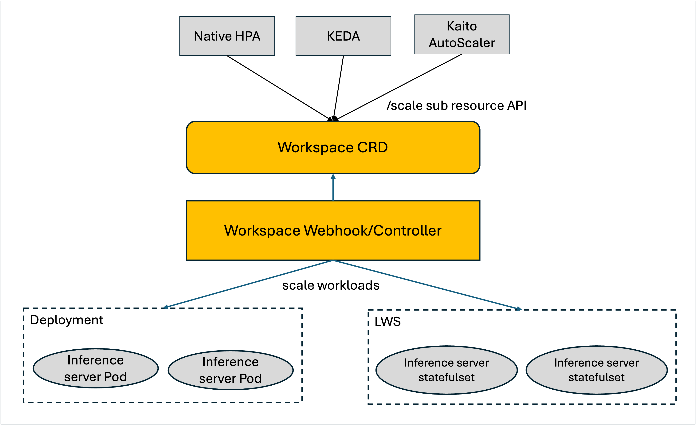

# Title

Auto Scaler for inference workloads in Kaito

## Summary

As the number of waiting inference requests increases, it is necessary to scale more inference instances in order to prevent blocking inference requests. On the other hand, if the number of waiting inference requests declines, we should consider reducing inference instances to improve GPU resource utilization.
Native Kubernetes has provided HPA capability to scale workload instances automatically as the metrics change, but HPA depends on third-party components (like Prometheus, Prometheus Adapter, etc.) to collect custom metrics from the source pods.

In this proposal, we hope to support a customized auto-scaler which is specialized for scaling GPU workloads for Kaito. The auto-scaler is designed for a minimalistic configuration experience, with most parameters pre-tuned for optimal performance. This allows users to easily get started without requiring specialized knowledge of LLM.

## Motivation

LLM inference service is a basic and widely-used feature in Kaito, and Kaito community interest in auto-scaler for inference workloads continues to intensify. Related issues: [#306](https://github.com/kaito-project/kaito/issues/306), [#1104](https://github.com/kaito-project/kaito/issues/1104).

From the technical perspective, it's a good idea to provide auto-scaler capability because the auto-scaler of inference workloads dynamically adjusts the number of inference instances based on request volume—scaling up during traffic spikes to improve inference speed, and scaling down during low demand to minimize GPU resource waste. Furthermore, for workloads with predictable, recurring traffic patterns, a time-based scaler can proactively adjust capacity, ensuring resources are ready before they are needed.

The auto-scaler solution for Kaito should be shown as follows:



We will divide this auto-scaler feature into two parts as follows:

- Part one: support scale subresource API for workspace, so different auto-scaler solutions such as KEDA, HPA, etc. can be integrated with Kaito to manage inference workloads dynamically. This part is addressed in another proposal: https://github.com/kaito-project/kaito/pull/1184.
- Part two: support a customized auto-scaler for Kaito. The auto-scaler is designed for a minimalistic configuration experience, with most parameters pre-tuned for optimal performance. This allows users to easily get started without requiring specialized knowledge of LLM. This part will be addressed in this proposal. We name this auto-scaler as llm-auto-scaler, which will support both reactive (metric-based) and proactive (time-based) scaling.

To ensure ease of use, the specialized auto-scaler is hosted in an independent repo (kaito-project/llm-auto-scaler). At the same time, the llm-auto-scaler component can work with Kaito without depending on any third-party components.

### Goals

- llm-auto-scaler is a specialized auto-scaler for scaling gpu workloads automatically, and can integrate with kaito to work.
- It is flexible enough to support multiple scalers. This proposal introduces two primary scalers: a metric-based scaler for reactive scaling and a cron-based scaler for proactive, scheduled scaling.

### Non-Goals/Future Work

- The time efficiency of the auto-scaler is not within the scope of this proposal, as it is influenced by mutliple external factors, including GPU node provisioning, LLM image pulling, etc.
- Only support scale vllm workload, and non-vllm is not covered.

## Proposal

### LLM-Auto-Scaler Architecture

The llm-auto-scaler component determines the desired number of replicas based on the configured scaling strategy in the `LLMAutoScaler` CRD. For metric-based scaling, it scrapes metrics from the inference pods. For time-based scaling, it evaluates cron schedules. The scaler controller then calculates the desired replica count and scales the workspace replicas through the `/scale` subresource API. The detailed auto-scaler architecture is shown in the following figure:


- **LLMAutoScaler CRD**: Defines the auto-scaler configuration, including the scaling strategy (metric-based or time-based), target resource, and scaling parameters.
- **Metrics Scraper**: A module of the llm-auto-scaler used for scraping metrics from inference pods. This component is active only when a `RealtimeScaler` (metric-based) strategy is configured.
- **Multiple Scalers**: The proposal supports two primary scaling strategies: `RealtimeScaler` for reactive scaling based on metrics, and `CronScaler` for proactive scaling based on a predefined schedule. These scalers determine the algorithm used to calculate the desired number of replicas.
- **Scaler Controller**: The core logic that integrates the selected scale strategy (either with scraped metrics or cron schedules) to calculate the desired replicas and invokes the `/scale` subresource API of the target workspace.

### LLMAutoScaler CRD

```
type ProtocolType string

const (
	HTTP  ProtocolType = "http"
	HTTPS ProtocolType = "https"
)

// MetricSource defines the way to fetch the specific metric
type MetricSource struct {
	// Name identifies the specific metric to monitor.
	// If unset, vllm:num_requests_waiting will be used.
	Name string

	// Protocol specify the protocol for accessing pods, http and https are supported.
	// if unset, http will be used.
	Protocol ProtocolType

	// Port specify the port of pods /metrics endpoint.
	// if unset, 5000 will be used.
	Port string

	// Path specify the path of the metric endpoint.
	// if unset, /metrics will be used.
	Path string
}

type MetricThreshold struct {
	// High means the upper threshold, when the value of the monitored metric exceeds this number,
	// the autoscaler will decide to scale up.
	High int32

	// Low mens the lower threshold. when the value of the monitored metric drops below this number,
	// the autoscaler will scale down.
	Low int32
}

type Metric struct {
	// metric identifies the way to fetch target metric
	// if unset, scaler will fetch metric(vllm:num_requests_waiting) from http://{pod-ip}:5000/metrics endpoint. 
	// and pod-ip is retrieved from pods that related the ScaleTargetRef.
	// +optional
	Source MetricSource

	// threshold defines the boundaries used to trigger scaling actions basd on the monitored metric.
	Threshold MetricThreshold
}

type ScalerRule struct {
	// CooldownSeconds defines the waiting period after a scaling action.
	// +optional
	CooldownSeconds *int32

	// StabilizationWindowSeconds defines the lookback window to prevent premature scaling.
	// +optional
	StabilizationWindowSeconds *int32

	// ScaleStep defines the number of replicas increase/reduce during a scaling action.
	ScaleStep *int32
}

type RealtimeScaler struct {
	// Metrics contains the specifications for how to fetch the specified metrics and their scale thresholds.
	// If multiple metrics are specified, the scaler will calculate the desired replicas for each metric and choose the highest value.
	Metrics []Metric

	// ScaleUpRule defines the rules for scaling up.
	// if unset, ScaleStep will set to 1, CooldownSeconds to 600, and StabilizationWindowSeconds to 30.
	// +optional
	ScaleUpRule ScalerRule

	// ScaleDownRule defines the rules for scaling down.
	// if unset, ScaleStep will set to 1, CooldownSeconds to 1800, and StabilizationWindowSeconds to 300.
	// +optional
	ScaleDownRule ScalerRule
}

type CronPolicy struct {
	// Name is used to specify the name of the policy.
	Name string
	// The schedule in Cron format, see https://en.wikipedia.org/wiki/Cron.
	Schedule string
	// TargetReplicas is used to specify the desired number of replicas.
	TargetReplicas int32
	// TimeZone is the timezone for interpreting the schedule.
	// If unset, "Etc/UTC" will be used, which interprets the schedule relative to Coordinated Universal Time.
	// +optional
	TimeZone string
}

type CronScaler struct {
	// Policies is a list of cron policies that define the cron scaling schedule.
	Policies []CronPolicy
}

type Scaler struct {
	// Realtime represents a realtime auto scaler that scales up/down workloads according to metric changes.
	// At the same time, realtime auto scaler works in a passive mode, it means inference requests will be blocked before new inference workloads added.
	// +optional
	Realtime *RealtimeScaler

	// Cron represents a cron auto scaler that scales up/down workloads at specified time.
	// And cron auto scaler works in a proactive mode, the inference workloads will be ready before the inference requests spikes.
	Cron *CronScaler
}

type LLMAutoScalerSpec struct {
	// scaleTargetRef points to the target resource to scale. e.g. Workspace
	ScaleTargetRef autoscalingv2api.CrossVersionObjectReference

	// MinReplicas is the lower limit for the number of replicas to which the autoscaler
	// can scale down. Default value is 1.
	// +optional
	MinReplicas *int32

	// MaxReplicas is the upper limit for the number of replicas to which the autoscaler can scale up.
	// It cannot be less that MinReplicas.
	MaxReplicas int32

	// Scaler defines the scaling strategy, which can be either metric-based (Realtime) or time-based (Cron).
	Scaler Scaler
}

type LLMAutoScalerStatus struct {
	// lastScaleTime is the last time the LLMAutoScaler scaled the number of inference workloads,
	// used by the autoscaler to control how often the number of inference workloads is changed.
	// +optional
	LastScaleTime *metav1.Time

	// currentReplicas is current number of replicas of inference workloads managed by this autoscaler,
	// as last seen by the autoscaler.
	// +optional
	CurrentReplicas int32

	// desiredReplicas is the desired number of replicas of inference workloads managed by this autoscaler,
	// as last calculated by the autoscaler.
	DesiredReplicas int32

	// Conditions is the set of conditions required for this autoscaler to scale its target,
	// and indicates whether or not those conditions are met.
	Conditions []metav1.Condition
}

type LLMAutoScaler struct {
	metav1.TypeMeta
	metav1.ObjectMeta

	Spec   LLMAutoScalerSpec
	Status LLMAutoScalerStatus
}
```

### Realtime Scaler

#### Metrics Scraper

- Metrics Scraper fetches specified metrics from pods' /metrics endpoint according to `LLMAutoScaler.Spec.Scaler.Realtime.Metrics` at a 15s interval.
- For each metric in the `Metrics` list, the scraper will:
    - Construct the endpoint URL: `metric.Source.Protocol://{pod ip}:metric.Source.Port/metric.Source.Path`. The default is `http://{pod ip}:5000/metrics`.
    - Get pod IPs from the pods referenced by `InferenceAutoScaler.Spec.ScaleTargetRef`.
    - Resolve the metric value from the response using `metric.Source.Name`. The default metric name is `vllm:num_requests_waiting`.
- If multiple pods are selected, the average metric value will be calculated for each metric.
- If a metric cannot be resolved from a pod (e.g., the pod is pending), the average value will be calculated using the following rules to prevent flapping:
  - In the scale-up direction: use 0 as the metric value for missing pods.
  - In the scale-down direction: use the metric's `High` threshold as the value for missing pods.

#### Scaler Rule

The realtime scaler is used to scale GPU workloads according to specified metric changes. it means that realtime scaler is a passive scaling. 
and the scaling rules will be integrated to calculate desired replicas.


| item | scale up(default value) | scale down(default value) | introduication |
|----------|----------|----------|----------|
| scale step    | 1   | 1   |  only increase/reduce one replica in a scaling action, because the cost of gpu resource is really high |
| cooldown seconds    | 600   | 1800   | a waiting period after a scaling action for preventing frequent scaling |
| stablizationwindow seconds    | 30   | 300   | a lookback window that delays scaling decisions for avoiding premature scaling. and we hope scale-up to respond more quickly, while scale-down should occur more slowly. It means that scale-up is triggered only when the metric value exceeds the high threshold in 2 consecutive periods. and scale-down is triggered only when the metric value less than low threshold in 20 consecutive periods |

#### Realtime Scaler Pseudocode

Inputs:

- CurrentReplicas: Actual number of replicas for target workload, resolved from /scale subresource API.
- AllMetrics: A list of all metrics with their current values, resolved by the metric scraper.
- MinReplicas: The min number of replicas for target object, related field: `LLMAutoScaler.Spec.MinReplicas`
- MaxReplicas: The max number of replicas for target object, related field: `LLMAutoScaler.Spec.MaxReplicas`
- ScaleUpStep: the scale step of scaling up action, related field: `LLMAutoScaler.Spec.Scaler.Realtime.ScaleUpRule.ScaleStep`
- ScaleDownStep: the scale step of scaling down action, related field: `LLMAutoScaler.Spec.Scaler.Realtime.ScaleDownRule.ScaleStep`
- UpStabilizationWindowSeconds: the stabilization window seconds of scaling up action, related field: `LLMAutoScaler.Spec.Scaler.Realtime.ScaleUpRule.StabilizationWindowSeconds`
- DownStabilizationWindowSeconds: the stabilization window seconds of scaling down action, related field: `LLMAutoScaler.Spec.Scaler.Realtime.ScaleDownRule.StabilizationWindowSeconds`
- UpCoolDownSeconds: the cool down seconds of scaling up action, related field: `LLMAutoScaler.Spec.Scaler.Realtime.ScaleUpRule.CoolDownSeconds`
- DownCoolDownSeconds: the cool down seconds of scaling down action, related field: `LLMAutoScaler.Spec.Scaler.Realtime.ScaleDownRule.CoolDownSeconds`
- LastScaleTime: the timestamp for the last scaling action, related field: `LLMAutoScaler.Status.LastScaleTime`
- MetricsHistory: include all latest metric values for each autoscaler, the type is: map[string][]timestampedMetricValue

Outputs:

- DesiredReplicas: Desired number of replicas for target workload. and the value will be used for scaling workload through /Scale subresource api.

```go
type timestampedMetricValue struct {
	value int32
	timestamp time.Time
}

func calculateDesiredReplicas(INPUTS) OUTPUTS{
	desiredReplicas := CurrentReplicas
	
	// Iterate over all metrics and calculate the desired replicas for each.
	// The final desired replicas will be the maximum of all calculations.
	for _, metric := range AllMetrics {
		// The logic inside calculateReplicasForMetric is the same as the previous single-metric pseudocode.
		// It returns a calculated number of replicas based on one metric's value and thresholds.
		metricDesiredReplicas := calculateReplicasForMetric(metric, CurrentReplicas, INPUTS)
		if metricDesiredReplicas > desiredReplicas {
			desiredReplicas = metricDesiredReplicas
		}
	}

	return desiredReplicas
}


func calculateReplicasForMetric(metric, CurrentReplicas, INPUTS) OUTPUTS{
	// 0. ensure metrics history updated for each reconcile
	defer updateMetricsHistory(LLMAutoScaler.Name + metric.Name, metric.Value, MetricsHistory, UpStabilizationWindowSeconds, DownStabilizationWindowSeconds)

	// 1. calculate the elapsed time for cooldown check
	cooldownElapsed := time.Now().Sub(LastScaleTime)

	// 2. scale up logic
	if metric.Value > metric.Threshold.High {
		// check stablization window
		if UpStabilizationWindowSeconds > 0 {
			windowMetrics := filterMetricsWithinWindow(LLMAutoScaler.Name + metric.Name, MetricsHistory, UpStabilizationWindowSeconds)
			minInWindow := min(windowMetrics)
			if minInWindow <= metric.Threshold.High {
				// there is a metric value below high threshold, so skip scale up
				return CurrentReplicas
			}
		}

		// check cooldown
		if cooldownElapsed > UpCoolDownSeconds {
			return min(CurrentReplicas + ScaleUpStep, MaxReplicas)
		}
	}

	// 3. scale down logic
	if metric.Value < metric.Threshold.Low {
		// check stablization window
		if DownStabilizationWindowSeconds > 0 {
			windowMetrics := filterMetricsWithinWindow(LLMAutoScaler.Name + metric.Name, MetricsHistory, DownStabilizationWindowSeconds)
			maxInWindow := max(windowMetrics)
			if maxInWindow >= metric.Threshold.Low {
				// there is a metric value above low threshold, so skip scale down
				return CurrentReplicas
			}
		}

		// check cooldown
		if cooldownElapsed > DownCoolDownSeconds {
			return max(CurrentReplicas - ScaleDownStep, MinReplicas)
		}
	}

	// 4. otherwise, skip scaling action
	return CurrentReplicas
}

func filterMetricsWithinWindow(key, metricsHistory, stabilizationWindowSeconds) windowMetrics {
	windowStartTime := time.Now().Add(-time.Second * time.Duration(stabilizationWindowSeconds))

	for i, timestampMetric := range metricsHistory[key] {
		if timestampMetric.timestamp.After(windowStartTime) {
			windowMetrics = append(windowMetrics, timestampMetric.Value)
		}
	}

	return windowMetrics
}

func updateMetricsHistory(key, currentValue, metricsHistory, upStabilizationWindowSeconds, downStabilizationWindowSeconds) {
	upWindowStartTime := time.Now().Add(-time.Second * time.Duration(upStabilizationWindowSeconds))
	downWindowStartTime := time.Now().Add(-time.Second * time.Duration(downStabilizationWindowSeconds))

	foundStaleMetric := false
	staleMetricIndex := 0
	for i, timestampMetric := range metricsHistory[key] {
		if timestampMetric.timestamp.Before(upWindowStartTime) && timestampMetric.timestamp.Before(downWindowStartTime) {
			foundStaleMetric = true
			staleMetricIndex = i
		}
	}

	// use the stale metric slot for controlling the size of metric slice
	if foundStaleMetric {
		metricsHistory[key][staleMetricIndex] = timestampedMetricValue{currentValue, time.Now()}
	} else {
		metricsHistory[key] = append(metricsHistory[key], timestampedMetricValue{currentValue, time.Now())
	}
}
```

### Cron Scaler

The Cron Scaler provides a proactive, time-based scaling mechanism that adjusts the number of replicas at scheduled times. Unlike the Realtime Scaler, which reacts to metric changes, the Cron Scaler allows you to align resource allocation with predictable traffic patterns, such as scaling up before business hours and scaling down during nights or weekends. This approach ensures that capacity is available before demand spikes, improving responsiveness and user experience.

Each cron policy defines a `schedule` in standard cron format and a `targetReplicas` count. The autoscaler will continuously monitor the clock and, when the current time matches a policy's schedule, it will adjust the workload's replica count to the specified target.

- Take the following policies as an example:

```yaml
policies:
  # The "scale-up" policy increases the number of replicas to 5 at 8:00 AM every day
  # to handle peak traffic during business hours.
  - name: "scale-up"
    schedule: "0 8 * * *" # Cron schedule for 8:00 AM daily
    targetReplicas: 5
    timeZone: "America/New_York" # Uses Eastern Time
  # The "scale-down" policy reduces the number of replicas to 1 at 1 minute past midnight (00:01)
  # every day to conserve resources during off-peak hours.
  - name: "scale-down"
    schedule: "1 0 * * *" # Cron schedule for 00:01 AM daily
    targetReplicas: 1
    timeZone: "America/New_York" # Uses Eastern Time
```

The `scale-up` policy will scale the number of replicas to 5 at 08:00 every day in the `America/New_York` timezone, and the `scale-down` policy will scale the number of replicas to 1 at 00:01 every day in the `America/New_York` timezone.

**TimeZone Support**: The `timeZone` field allows you to specify the timezone for interpreting the cron schedule. This is particularly useful for aligning scaling actions with business hours in specific geographic regions. The timezone must be a valid IANA Time Zone identifier (e.g., "America/New_York", "Europe/London", "Asia/Shanghai"). If not specified, it defaults to "Etc/UTC". More information can be found in https://en.wikipedia.org/wiki/List_of_tz_database_time_zones

#### Cron Scaler Pseudocode

Inputs:

- CurrentReplicas: Actual number of replicas for the target workload.
- CronPolicies: The list of cron policies defined in `LLMAutoScaler.Spec.Scaler.Cron.Policies`.
- MinReplicas: The minimum number of replicas for the target object.
- MaxReplicas: The maximum number of replicas for the target object.

Outputs:

- DesiredReplicas: Desired number of replicas for the target workload.

```go
import (
	"time"
	"github.com/robfig/cron/v3"
)

func calculateDesiredReplicasCron(INPUTS) OUTPUTS {
	var matchingReplicas []int32

	// Find all policies that match the current time
	for _, policy := range CronPolicies {
		location, err := time.LoadLocation(policy.TimeZone)
		if err != nil {
			location = time.UTC
		}
		nowInLocation := time.Now().In(location)

		schedule, err := cron.ParseStandard(policy.Schedule)
		if err != nil {
			continue
		}

		// Check if the last run was within the last minute, considering the policy's timezone
		lastRun := schedule.Next(nowInLocation.Add(-time.Minute))
		if nowInLocation.Truncate(time.Minute).Equal(lastRun.Truncate(time.Minute)) {
			matchingReplicas = append(matchingReplicas, policy.TargetReplicas)
		}
	}

	// If no policy matches, no change in replicas
	if len(matchingReplicas) == 0 {
		return CurrentReplicas
	}

	// If multiple policies match, pick the one with the highest replica count
	// to ensure capacity for the highest-demand schedule.
	desired := matchingReplicas[0]
	for i := 1; i < len(matchingReplicas); i++ {
		if matchingReplicas[i] > desired {
			desired = matchingReplicas[i]
		}
	}

	// Clamp the desired replicas within the min/max boundaries
	if desired < MinReplicas {
		desired = MinReplicas
	}
	if desired > MaxReplicas {
		desired = MaxReplicas
	}

	return desired
}
```

## Alternatives

This section compares the proposed `LLMAutoScaler` with existing Kubernetes autoscaling solutions, namely the native Horizontal Pod Autoscaler (HPA) and KEDA (Kubernetes Event-driven Autoscaling), to justify the need for a new, specialized autoscaler.

| Feature                    | Horizontal Pod Autoscaler (HPA)                               | KEDA                                                                 | LLMAutoScaler (This Proposal)                                       |
| :------------------------- | :------------------------------------------------------------ | :------------------------------------------------------------------- | :------------------------------------------------------------------ |
| **Scope & Specialization** | **General-purpose**: Scales any workload based on CPU/memory or custom metrics. | **General-purpose & Event-driven**: Extends HPA for event-driven workloads with a rich set of scalers (e.g., Kafka, RabbitMQ). | **Domain-specific**: Specialized for LLM inference workloads in Kaito, with deep optimizations for GPU resources. |
| **Ease of Use**            | **Moderate complexity**: Simple for CPU/memory, but complex for custom metrics, requiring manual setup of a metrics pipeline (e.g., Prometheus + Adapter). | **Flexible but complex**: Requires users to select, configure, and deploy the appropriate Scaler. Configuration can be verbose, and users may need to write queries (e.g., PromQL). | **Out-of-the-box & Simple**: Provides pre-tuned defaults and a simplified API tailored for LLM inference. Designed for ease of use without requiring deep autoscaling knowledge. |
| **Dependencies**           | **High for custom metrics**: Relies on an external monitoring stack (e.g., Prometheus) to collect and expose custom metrics. | **Relies on external systems**: Depends on the specific event source and often requires a monitoring stack like Prometheus for custom metric-based scaling. | **Zero-dependency**: Includes a built-in, lightweight metrics scraper, eliminating the need for third-party components like Prometheus for its core functionality. |
| **Scaling Logic**          | **Generic algorithm**: Uses a standard algorithm based on the ratio of current to desired metric values. Lacks fine-grained control over scale-up vs. scale-down behavior. | **Manages HPA**: Primarily acts as a metrics provider for HPA, driving the scaling logic through HPA. It adds scale-to-zero capability. | **Customized Algorithm**: Implements a custom algorithm with distinct stabilization windows and cooldowns for scaling up and down, optimized for expensive and slow-to-provision GPU resources. |
| **Core Features**          | - Metric-based scaling<br>- Native to Kubernetes             | - Event-driven scaling<br>- Scale-to-zero<br>- Rich ecosystem of scalers<br>- Supports Cron and other triggers | - Integrated metric and cron scaling<br>- Zero-dependency metric scraping<br>- Fine-tuned GPU scaling logic<br>- Simplified user experience |

### Justification for LLMAutoScaler

While HPA provides a solid foundation and KEDA offers powerful, general-purpose event-driven scaling, a specialized `LLMAutoScaler` is justified for the Kaito ecosystem for the following reasons:

1.  **Simplified User Experience**: The primary goal is to offer an extremely simple autoscaling solution for Kaito users. `LLMAutoScaler` achieves this by embedding domain knowledge (e.g., knowing how to scrape VLLM's waiting request metric by default) and providing pre-tuned, sensible defaults. This reduces a potentially complex setup to a few declarative fields in a CRD.

2.  **Reduced Operational Overhead**: The cost and complexity of deploying and maintaining a full Prometheus stack just for autoscaling a few inference services is prohibitive. The zero-dependency, built-in metrics scraper of `LLMAutoScaler` makes it lightweight, easy to adopt, and significantly cheaper to operate.

3.  **Optimized for GPU Scaling**: GPU resources are expensive, and their scaling behavior must be managed carefully to balance cost and performance. A generic scaling algorithm may scale up and down too frequently ("flapping"), incurring high costs. `LLMAutoScaler`'s custom algorithm, with its distinct stabilization windows and cooldowns for scaling up versus down, provides the necessary fine-grained control to prevent premature or overly aggressive scaling actions.

In conclusion, while KEDA and HPA are excellent tools for general-purpose autoscaling, the `LLMAutoScaler` is designed to be a superior solution *specifically for LLM inference workloads within Kaito*, prioritizing ease of use, low operational overhead, and optimized performance for its target use case.

## Acknowledgments

We would like to acknowledge the Kubernetes [Horizontal Pod Autoscaler (HPA)](https://kubernetes.io/docs/tasks/run-application/horizontal-pod-autoscale/), [CronJob](https://kubernetes.io/docs/concepts/workloads/controllers/cron-jobs/) and [AIBrix](https://github.com/vllm-project/aibrix) for providing inspiration and reference points in designing the LLMAutoScaler API. These projects helped us design a comprehensive solution that combines both reactive (metrics-based) and proactive (time-based) scaling strategies.

## Implementation History
- [ ] 06/10/2025: Open proposal PR
