# Kaito CLI - Plugin

## Summary

Kaito CLI provides a unified, user-friendly command-line interface for deploying, managing, and monitoring KAITO resources on Kubernetes. It aims to reduce friction for data scientists, ML engineers, and platform teams by abstracting away error-prone YAML authoring and enabling both interactive and automated workflows. The CLI can be designed to work as both a kubectl plugin or a standalone binary, supporting a wide range of use cases from rapid prototyping to production automation.

## Motivation

Currently, users interact with KAITO by manually crafting Kubernetes YAML manifests. This process is error-prone, unfriendly to non-Kubernetes experts, and slows down experimentation and deployment. As KAITO adoption grows, there is a need for a more accessible, robust, and automation-friendly interface that:

- Reduces the learning curve for new users
- Minimizes configuration errors
- Accelerates model deployment and iteration
- Supports both single-cluster and multi-cluster workflows
- Integrates with CI/CD pipelines and platform automation

### Goals

- Provide a user-friendly, error-resistant CLI for deploying and managing KAITO resources
- Support both kubectl plugin and standalone CLI workflows
- Enable rapid onboarding for data scientists and engineers
- Allow advanced features such as multi-cluster management, offline manifest rendering, and cost estimation
- Integrate with existing Kubernetes authentication and RBAC mechanisms
- Facilitate both interactive and automated (CI/CD) use cases
- Offer extensibility for future KAITO features (e.g., model catalog, distributed tuning)
- Ensure compatibility with the current KAITO repo structure and CRDs

### Non-Goals/Future Work

- Replacing or deprecating existing YAML workflows
- Implementing a web-based GUI (focus is CLI/terminal UX)
- Changing the underlying KAITO resource model or API
- Providing a full-featured model registry or artifact store
- Handling non-Kubernetes environments
- Deep integration with cloud provider-specific services (initial focus is on Kubernetes-native workflows)

## Solution Design

### Dual Delivery Approach

Kaito CLI can be delivered in two forms to address the needs of both operator-centric and platform-centric workflows:

#### Option A – Kubectl Plugin

Designed for engineers already comfortable with native Kubernetes tooling. By distributing the plugin through **Krew**, users avoid installing a separate binary, inherit their existing kube-contexts and RBAC, and benefit from familiar `kubectl` verb–noun syntax.

| **Use Case**                                       | **Example**                                                                                |
| -------------------------------------------------- | ------------------------------------------------------------------------------------------ |
| AI/ML engineer wants to deploy a new model version | `kubectl kaito deploy --name workspace-llama-3 --model llama-3 --gpus 1 --preset instruct` |
| AI/ML engineer fine-tuning in a known namespace    | `kubectl kaito tune --name workspace-llama-3-tune --dataset gs://teamA-ds --preset qlora`  |
| Operator wants status quickly                      | `kubectl kaito status workspace/workspace-llama-3-tune`                                    |

**Pros:**

- Seamless with existing `kubectl` usage
- Leverages RBAC, kube-context, and namespace scoping
- Easy to distribute via Krew
- Inherits kube auth lifecycle (no separate login flow)

**Cons:**

- Bound to kubectl's UX constraints
- Harder to add interactive features or offline preview
- Requires `kubectl` binary + plugin install for every user

#### Option B – Standalone CLI

A self-contained binary aimed at platform teams and automation pipelines that need functionality beyond what a kubectl plugin can comfortably deliver.

| **Use Case**                             | **Example**                                                                                                      |
| ---------------------------------------- | ---------------------------------------------------------------------------------------------------------------- |
| Platform team managing multiple clusters | `kaitoctl status --all --cluster us-east,us-west`                                                                |
| CI/CD offline manifest render            | `kaitoctl deploy --n workspace-phi --model phi --dry-run > ws.yaml`                                              |
| Ops analyst estimating GPU cost          | `kaitoctl cost --workspace gen-answers`                                                                          |
| LoRA tuning with progress bar            | `kaitoctl tune --name social-sentiment --interactive`                                                            |
| Distributed inference model deployment   | `kaitoctl deploy --name workspace-mixtral --model mixtral --distributed.enabled=true --distributed.partitions=4` |

**Pros:**

- Full UX control: CLI prompts, spinners, YAML preview, etc.
- Works without kubectl — just kubeconfig
- Can support offline use cases and CI manifest staging
- Supports **multi-cluster** targeting from a single command

**Cons:**

- Slightly larger binary with more dependencies
- Must manage auth lifecycle (client-go, OIDC, token refresh)
- Requires separate install path (brew, apt, etc.)

### Decision Drivers

1. **Adoption barrier**: If speed of rollout is top priority, Option A excels
2. **Feature depth**: For advanced, multi-cluster, or offline workflows, Option B is preferable
3. **Resourcing**: Building both offers the richest UX but doubles initial engineering effort

## Core Features and Commands

### Workspace Management

#### Deployment Commands

```bash
# Basic inference deployment
kubectl kaito deploy --name my-workspace --model phi-3.5-mini-instruct --instance-type Standard_NC6s_v3

# Deploy with specific runtime
kubectl kaito deploy --name my-workspace --model phi-3-mini --runtime vllm
kubectl kaito deploy --name my-workspace --model falcon-7b --runtime transformers

# Deploy with adapters
kubectl kaito deploy --name my-workspace --model phi-3-mini \
  --adapter my-adapter:v1 --adapter-strength 0.8

# Deploy distributed inference
kubectl kaito deploy --name my-distributed --model llama-3.3-70b \
  --distributed --nodes 4 --runtime vllm

# Deploy with feature gates
kubectl kaito deploy --name my-workspace --model phi-3-mini --feature-gates vLLM=true,ensureNodeClass=false
```

#### Management Commands

```bash
# Scale inference replicas
kubectl kaito scale workspace/my-workspace --replicas 3

# Status and monitoring
kubectl kaito status workspace/my-workspace
kubectl kaito logs workspace/my-workspace --follow

# Health checks
kubectl kaito health check --workspace my-workspace --detailed
```

### Tuning Workflows

#### Basic Tuning

```bash
# Deploy tuning workload
kubectl kaito tune --name my-tuning --model phi-3-mini --method qlora --input gs://my-dataset --output my-registry/adapter:v1

# Advanced tuning with custom configuration
kubectl kaito tune --name my-tuning --model falcon-7b --method lora \
  --config my-lora-config \
  --input pvc://training-data \
  --output pvc://output-adapters \
  --epochs 5 \
  --batch-size 4
```

#### Tuning Management

```bash
# Tuning status and monitoring
kubectl kaito tune status my-tuning
kubectl kaito tune logs my-tuning --follow
kubectl kaito tune metrics my-tuning --show-gpu-utilization

# Tuning with resource optimization
kubectl kaito tune --name my-tuning --model llama-3.3-70b --method qlora \
  --auto-optimize-resources \
  --instance-type Standard_NC24ads_A100_v4 \
  --show-cost-estimate
```

### RAG Operations

#### Deployment

```bash
# Deploy RAG engine with local embedding
kubectl kaito rag deploy --name my-rag --embedding-model BAAI/bge-small-en-v1.5 --inference-url http://my-service/v1/completions

# Deploy complete RAG stack with workspace integration
kubectl kaito rag deploy --name my-rag-app \
  --embedding-model BAAI/bge-small-en-v1.5 \
  --llm-workspace my-inference-workspace \
  --vector-store faiss \
  --instance-type Standard_NC6s_v3

# Deploy RAG with external inference service
kubectl kaito rag deploy --name my-rag-external \
  --embedding-model BAAI/bge-small-en-v1.5 \
  --inference-url https://api-inference.huggingface.co/models/HuggingFaceH4/zephyr-7b-beta/v1/completions \
  --inference-secret huggingface-token
```

#### Document and Query Management

```bash
# Manage RAG indices and documents
kubectl kaito rag index --name my-rag --add-document doc.pdf
kubectl kaito rag index --name my-rag --add-documents-dir ./docs --batch-size 10
kubectl kaito rag index --name my-rag --list-documents
kubectl kaito rag index --name my-rag --delete-document doc-id-123

# Query and test RAG system
kubectl kaito rag query --name my-rag --question "What is KAITO?"
kubectl kaito rag query --name my-rag --question "What is KAITO?" --show-context --top-k 3
kubectl kaito rag test --name my-rag --test-file questions.csv --output results.json
```

#### RAG System Management

```bash
# RAG system management
kubectl kaito rag status my-rag
kubectl kaito rag logs my-rag --follow
kubectl kaito rag scale my-rag --replicas 3
kubectl kaito rag backup my-rag --output ./backup/
kubectl kaito rag restore my-rag --from ./backup/
```

### Model Management

#### Model Catalog Operations

```bash
# List supported models with detailed information
kubectl kaito models list --output table
kubectl kaito models list --output json

# Show model details
kubectl kaito models describe phi-3.5-mini-instruct
kubectl kaito models describe llama-3.3-70b-instruct --show-runtime-params

# Model compatibility and validation
kubectl kaito models validate --model phi-3-mini --instance-type Standard_NC6s_v3
kubectl kaito models validate --model llama-3.3-70b --distributed --nodes 4

# Runtime selection and configuration
kubectl kaito models runtime --model phi-3-mini --runtime vllm
kubectl kaito models runtime --model falcon-7b --runtime transformers --show-config
```

#### Resource Estimation

```bash
# Estimate resource requirements
kubectl kaito models estimate --model llama-3.3-70b-instruct --replicas 2
kubectl kaito models estimate --model phi-3-mini --method qlora --show-cost
```

### Configuration Management

#### Tuning Configurations

```bash
# Manage tuning configurations
kubectl kaito config create-tuning --name my-qlora-config --method qlora --model phi-3-mini
kubectl kaito config create-tuning --name my-lora-config --method lora --model falcon-7b --from-template
kubectl kaito config edit-tuning my-qlora-config --set lora.r=16 --set lora.alpha=32
kubectl kaito config show-tuning my-qlora-config --output yaml
```

#### Inference Configurations

```bash
# Manage inference configurations
kubectl kaito config create-inference --name my-vllm-config --runtime vllm --model phi-3-mini
kubectl kaito config edit-inference my-vllm-config --set max_tokens=2048 --set temperature=0.7
kubectl kaito config show-inference my-vllm-config --output json
```

#### Template Management

```bash
# Template management
kubectl kaito config templates list
kubectl kaito config templates show qlora-params-template --output yaml
kubectl kaito config templates create --name my-template --from qlora-params-template

# Configuration validation
kubectl kaito config validate my-qlora-config --model phi-3-mini
kubectl kaito config validate my-vllm-config --instance-type Standard_NC6s_v3
```

### Monitoring and Observability

#### Resource Monitoring

```bash
# Resource monitoring
kubectl kaito monitor resources --workspace my-workspace --show-gpu-utilization
kubectl kaito monitor resources --ragengine my-rag --show-memory-usage
kubectl kaito monitor resources --all --output dashboard
```

#### Performance Metrics

```bash
# Performance metrics
kubectl kaito metrics inference --workspace my-workspace --show-throughput
kubectl kaito metrics tuning --workspace my-tuning --show-loss-curve
kubectl kaito metrics rag --ragengine my-rag --show-query-latency
```

#### Health and Diagnostics

```bash
# Health checks and diagnostics
kubectl kaito health check --workspace my-workspace
kubectl kaito health check --ragengine my-rag --detailed
kubectl kaito health check --all --output report

# Log analysis and troubleshooting
kubectl kaito logs analyze --workspace my-workspace --show-errors
kubectl kaito logs analyze --ragengine my-rag --show-warnings
kubectl kaito logs search --workspace my-workspace --query "OOM" --time-range 1h
```

#### Alerting

```bash
# Alerting and notifications
kubectl kaito alerts list --workspace my-workspace
kubectl kaito alerts configure --workspace my-workspace --gpu-utilization-threshold 90
kubectl kaito alerts test --workspace my-workspace
```

### Cost Management

#### Cost Estimation

```bash
# Basic cost estimation
kaitoctl cost --workspace my-workspace --duration 8h
# Output: Estimated cost: $12.50 for Standard_NC6s_v3 (8 hours)

# Advanced cost analysis with model requirements
kaitoctl cost estimate --model llama-3.3-70b-instruct --instance-type Standard_NC24ads_A100_v4 --duration 24h
kaitoctl cost estimate --model phi-3-mini --method qlora --duration 4h --show-breakdown
```

#### Cost Comparison and Optimization

```bash
# Multi-cloud cost comparison
kaitoctl cost compare --model phi-3-mini --duration 8h --clouds azure,aws
kaitoctl cost compare --workspace my-workspace --clouds azure,aws --show-instance-types

# Cost optimization suggestions
kaitoctl cost optimize --model llama-3.3-70b-instruct --budget 100 --duration 24h
kaitoctl cost optimize --workspace my-workspace --show-alternatives

# Historical cost analysis
kaitoctl cost history --workspace my-workspace --days 30
kaitoctl cost history --namespace kaito --show-trends
```

### Advanced Features

#### Multi-Cluster Management

```bash
# Multi-cluster targeting
kaitoctl deploy --model phi-3.5-mini-instruct --cluster prod,staging --dry-run
kaitoctl status --all --cluster us-east,us-west
```

#### Feature Gates Integration

The CLI will respect and integrate with KAITO's feature gate system:

- Check enabled feature gates
- Deploy with specific feature gate configurations
- Validate feature gate compatibility with models and runtimes

```bash
# Check enabled feature gates
kubectl kaito features list
kubectl kaito features status vLLM
kubectl kaito features enable ensureNodeClass
```

#### Adapter Management

```bash
# Manage adapters
kubectl kaito adapters list --workspace my-workspace
kubectl kaito adapters add --workspace my-workspace --adapter new-adapter:v1
kubectl kaito adapters remove --workspace my-workspace --adapter old-adapter:v1
```

#### Security and RBAC

```bash
# Check permissions for current user
kubectl kaito auth check --workspace my-workspace
kubectl kaito auth check --ragengine my-rag
```

#### Runtime Compatibility Check

```bash
kubectl kaito models runtime --model phi-3-mini --check-compatibility
```

## Technical Architecture

### Implementation Architecture

This project will be developed in a separate repository under the `kaito-project` organization on GitHub `github.com/kaito-project/kaito-cli`.

The CLI will use a shared library approach to maximize code reuse between the kubectl plugin and standalone binary:

```mermaid

graph TB
    CLI[Kaito CLI] --> SharedLib[Shared CLI Library]
    SharedLib --> WorkspaceAPI[Workspace API v1beta1]
    SharedLib --> RAGEngineAPI[RAGEngine API v1alpha1]
    SharedLib --> ModelCatalog[Model Catalog Parser]
    SharedLib --> K8sClient[Kubernetes Client-go]
    SharedLib --> SKUHandler[SKU Handler Integration]
    SharedLib --> ConfigManager[Configuration Manager]
    SharedLib --> MetricsCollector[Metrics Collector]
    
    ModelCatalog --> SupportedModels[supported_models.yaml]
    ModelCatalog --> ModelRegistry[Model Registry Plugin System]
    WorkspaceAPI --> WorkspaceController[Workspace Controller]
    RAGEngineAPI --> RAGController[RAGEngine Controller]
    SKUHandler --> AzureSKU[Azure SKU Handler]
    SKUHandler --> AWSSKU[AWS SKU Handler]
    SKUHandler --> ArcSKU[Arc SKU Handler]
    ConfigManager --> TuningTemplates[Tuning Config Templates]
    ConfigManager --> InferenceTemplates[Inference Config Templates]
    MetricsCollector --> PrometheusMetrics[Prometheus Metrics]
    MetricsCollector --> CustomMetrics[Custom KAITO Metrics]
    
    K8sClient --> KubeConfig[kubeconfig]
    K8sClient --> RBAC[Kubernetes RBAC]
    K8sClient --> CRDs[KAITO CRDs]
    
    subgraph "KAITO Core Systems"
        WorkspaceController
        RAGController
        ModelRegistry
        TuningTemplates
        InferenceTemplates
    end
    
    subgraph "Cloud Providers"
        AzureSKU
        AWSSKU
    end
```



### Integration with KAITO Systems

#### Model Catalog Integration

The CLI will parse and expose KAITO's built-in model catalog and registration system:

```yaml
# Example from supported_models.yaml
models:
  - name: phi-3.5-mini-instruct
    type: text-generation
    runtime: tfs
    tag: 0.2.0
  - name: llama-3.3-70b-instruct
    type: text-generation
    downloadAtRuntime: true
    tag: 0.0.1
```

This enables features like:

- Model auto-completion in CLI with validation against registered models
- Resource requirement estimation using model preset parameters
- Runtime configuration suggestions based on model capabilities
- SKU compatibility validation using existing SKU handlers
- Tuning method validation (LoRA/QLoRA support per model)

#### SKU Handler Integration

The CLI will leverage KAITO's existing SKU handlers for:

- Instance type validation
- GPU resource requirement checking
- Cost estimation across cloud providers (Azure, AWS, Arc)
- Resource optimization suggestions

#### Configuration Template Integration

The CLI will integrate with KAITO's existing ConfigMap templates for:

- LoRA and QLoRA tuning configurations
- Inference runtime configurations
- Template validation and customization
- Configuration versioning and management

#### Configuration and State Management

The CLI will integrate with existing KAITO patterns:

- Respect kubeconfig contexts and namespaces
- Support KAITO-specific annotations and labels
- Handle workspace revisions and status conditions
- Integrate with KAITO's feature gate system

## Implementation History

- 2025-06-30: Initial draft proposal for Kaito CLI and plugin

## POC/Demo

- https://github.com/helayoty/kubectl-kaito
