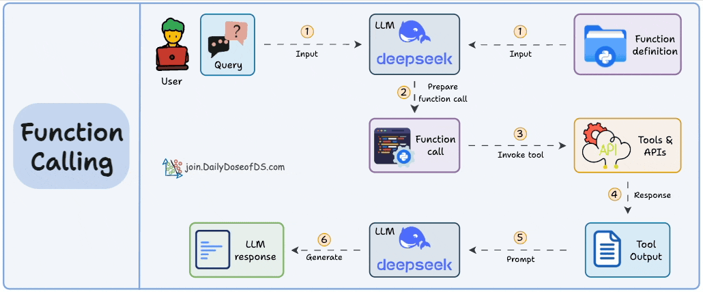

KAITO supports tool calling, allowing you to integrate external tools into your inference service. This feature enables the model to call APIs or execute functions based on the input it receives, enhancing its capabilities beyond text generation.

## Requirements

### Supported Inference Runtimes

Currently, tool calling is only supported with the vLLM inference runtime.

### Supported Models & Chat Templates

Proper chat templates are required for tool calling. The following models and their corresponding chat templates are supported:

| Model Family | Chat Templates                                                                                                                                             | Tool Parser in vLLM |
|--------------|------------------------------------------------------------------------------------------------------------------------------------------------------------|---------------------|
| Phi 4        | [tool-chat-phi4-mini.jinja](https://github.com/kaito-project/kaito/blob/main/presets/workspace/inference/chat_templates/tool-chat-phi4-mini.jinja)         | `phi4_mini_json`    |
| Llama 3      | [tool-chat-llama3.1-json.jinja](https://github.com/kaito-project/kaito/blob/main/presets/workspace/inference/chat_templates/tool-chat-llama3.1-json.jinja) | `llama3_json`       |
| Mistral      | [tool-chat-mistral.jinja](https://github.com/kaito-project/kaito/blob/main/presets/workspace/inference/chat_templates/tool-chat-mistral.jinja)             | `mistral`           |


### Inference Configurations

Create the following ConfigMap before deploying KAITO workspace, with `tool-call-parser` and `chat-template` set to the appropriate values for your model:

```yaml
apiVersion: v1
kind: ConfigMap
metadata:
  name: tool-calling-inference-config
data:
  inference_config.yaml: |
    # Maximum number of steps to find the max available seq len fitting in the GPU memory.
    max_probe_steps: 6

    vllm:
      cpu-offload-gb: 0
      swap-space: 4
      tool-call-parser: "phi4_mini_json" | "llama3_json" | "mistral"
      chat-template: "/workspace/chat_templates/<chat_template_name>.jinja"
```

In the Workspace configuration, set `.inference.config` to the name of the ConfigMap you created. For example:

```yaml
apiVersion: kaito.sh/v1beta1
kind: Workspace
metadata:
  name: workspace-phi-4-mini-tool-call
resource:
  instanceType: "Standard_NC24ads_A100_v4"
  labelSelector:
    matchLabels:
      apps: phi-4
inference:
  preset:
    name: phi-4-mini-instruct
  config: tool-calling-inference-config
```

For more details on the inference configuration, refer to [vLLM tool calling documentation](https://docs.vllm.ai/en/latest/features/tool_calling.html).

## Examples

Port-forward the inference service to your local machine:

```bash
kubectl port-forward svc/workspace-phi-4-mini-tool-call 8000
```

### Named Function Calling


*Source: Daily Dose of Data Science [^1]*

```python
from openai import OpenAI
import json

client = OpenAI(base_url="http://localhost:8000/v1", api_key="dummy")

def get_weather(location: str, unit: str):
    return f"Getting the weather for {location} in {unit}..."
tool_functions = {"get_weather": get_weather}

tools = [{
    "type": "function",
    "function": {
        "name": "get_weather",
        "description": "Get the current weather in a given location",
        "parameters": {
            "type": "object",
            "properties": {
                "location": {"type": "string", "description": "City and state, e.g., 'San Francisco, CA'"},
                "unit": {"type": "string", "enum": ["celsius", "fahrenheit"]}
            },
            "required": ["location", "unit"]
        }
    }
}]

response = client.chat.completions.create(
    model=client.models.list().data[0].id,
    messages=[{"role": "user", "content": "What's the weather like in San Francisco?"}],
    tools=tools,
    tool_choice="auto"
)

tool_call = response.choices[0].message.tool_calls[0].function
print(f"Function called: {tool_call.name}")
print(f"Arguments: {tool_call.arguments}")
print(f"Result: {tool_functions[tool_call.name](**json.loads(tool_call.arguments))}")
```

Expected output:

```
Function called: get_weather
Arguments: {"location": "San Francisco, CA", "unit": "fahrenheit"}
Result: Getting the weather for San Francisco, CA in fahrenheit...
```

### Model Context Protocol (MCP)

With the right client framework, inference workload provisioned by KAITO can also call external tools using the [Model Context Protocol (MCP)](https://modelcontextprotocol.io/). This allows the model to integrate and share data with external tools, systems, and data sources.


*Source: Daily Dose of Data Science [^1]*

In the following example, we will use [uv](https://docs.astral.sh/uv/) to create a Python virtual environment and install the necessary dependencies for [AutoGen](https://microsoft.github.io/autogen/stable//index.html) to call the [DeepWiki](https://deepwiki.com/) MCP service and ask questions about the KAITO project.

```bash
mkdir kaito-mcp
cd kaito-mcp
# Create and activate a virtual environment
uv venv && source .venv/bin/activate
# Install dependencies
uv pip install "autogen-ext[openai]" "autogen-agentchat" "autogen-ext[mcp]"
```

Create a Python script `test.py` with the following content:

```python
import asyncio

from autogen_agentchat.agents import AssistantAgent
from autogen_agentchat.ui import Console
from autogen_core import CancellationToken
from autogen_core.models import ModelFamily, ModelInfo
from autogen_ext.models.openai import OpenAIChatCompletionClient
from autogen_ext.tools.mcp import (StreamableHttpMcpToolAdapter,
                                   StreamableHttpServerParams)
from openai import OpenAI


async def main() -> None:
    # Create server params for the remote MCP service
    server_params = StreamableHttpServerParams(
        url="https://mcp.deepwiki.com/mcp",
        timeout=30.0,
        terminate_on_close=True,
    )

    # Get the ask_question tool from the server
    adapter = await StreamableHttpMcpToolAdapter.from_server_params(server_params, "ask_question")

    model = OpenAI(base_url="http://localhost:8000/v1", api_key="dummy").models.list().data[0].id
    model_info: ModelInfo = {
        "vision": False,
        "function_calling": True,
        "json_output": True,
        "family": ModelFamily.UNKNOWN,
        "structured_output": True,
        "multiple_system_messages": True,
    }

    # Create an agent that can use the ask_question tool
    model_client = OpenAIChatCompletionClient(base_url="http://localhost:8000/v1", api_key="dummy", model=model, model_info=model_info)
    agent = AssistantAgent(
        name="deepwiki",
        model_client=model_client,
        tools=[adapter],
        system_message="You are a helpful assistant.",
    )

    await Console(
        agent.run_stream(task="In the GitHub repository 'kaito-project/kaito', how many preset models are there?", cancellation_token=CancellationToken())
    )


if __name__ == "__main__":
    asyncio.run(main())
```

To run the script, execute the following command in your terminal:

```bash
uv run test.py
```

Expected output:

```
---------- TextMessage (user) ----------
In the GitHub repository 'kaito-project/kaito', how many preset models are there?

---------- ToolCallRequestEvent (deepwiki) ----------
[FunctionCall(id='chatcmpl-tool-4e22b15c32d34430b80078a3acc41f0d', arguments='{"repoName": "kaito-project/kaito", "question": "How many preset models are there?"}', name='ask_question')]

---------- ToolCallExecutionEvent (deepwiki) ----------
[FunctionExecutionResult(content='[{"type": "text", "text": "There are 16 preset models in the Kaito project.  These models are defined in the `supported_models.yaml` file  and registered programmatically within the codebase. ...", "annotations": null, "meta": null}]', name='ask_question', call_id='chatcmpl-tool-4e22b15c32d34430b80078a3acc41f0d', is_error=False)]

---------- ToolCallSummaryMessage (deepwiki) ----------
[{"type": "text", "text": "There are 16 preset models in the Kaito project.  These models are defined in the `supported_models.yaml` file  and registered programmatically within the codebase. ...", "annotations": null, "meta": null}]
```

[^1]: https://www.dailydoseofds.com/p/function-calling-mcp-for-llms/
