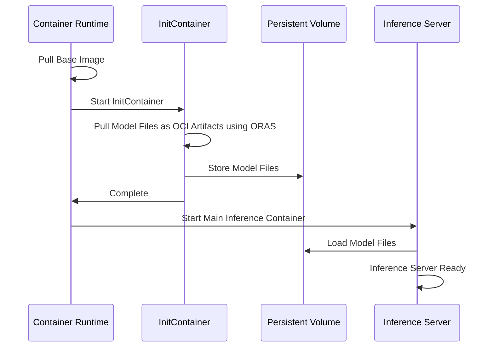

# Model As OCI Artifacts

KAITO supports distributing Large Language Model (LLM) files as Open Container Initiative (OCI) artifacts, providing a scalable and efficient alternative for model packaging and deployment.

## Overview

As Large Language Models continue to grow in size and complexity, traditional containerized distribution approaches face significant challenges. The Model As OCI Artifacts feature addresses these challenges by separating model files from runtime containers, enabling more efficient builds, faster deployments, and better maintainability.

## Benefits

### Reduced Build Times
- **Faster Image Builds**: Eliminate the need to rebuild entire images when only runtime components change
- **Parallel Development**: Model files and runtime components can be updated independently
- **Efficient CI/CD**: Reduce overall build pipeline duration from hours to minutes

### Improved Performance
- **Faster Downloads**: Leverage OCI registry optimizations for concurrent downloads
- **Better Compression**: Use advanced compression algorithms like Zstd for superior performance
- **Optimized Storage**: Reduce registry storage requirements through deduplication

### Enhanced Maintainability
- **Simplified Updates**: Update runtime libraries without touching model files
- **Version Management**: Independently version model files and runtime components
- **Registry Efficiency**: Better utilize OCI registry features and optimizations

## How It Works

The Model As OCI Artifacts feature splits the traditional monolithic approach into two components:

1. **Base Runtime Image**: Contains the inference server and dependencies
2. **Model OCI Artifacts**: Contains the model files packaged as OCI artifacts

### Architecture



### Process Flow

1. **Container Startup**: The container runtime pulls the lightweight base image
2. **Model Download**: An initContainer uses ORAS to download model files as OCI artifacts
3. **Storage**: Model files are stored in a persistent volume
4. **Inference**: The main container loads models from the persistent volume

## Performance Comparison

Our testing shows significant improvements across different configurations:


### Test Results

| Configuration | Description | Performance Impact |
|---------------|-------------|-------------------|
| **Baseline** | Single-layer image with gzip compression | Current approach |
| **Multi-layer** | Split model files into individual layers | Improved download concurrency |
| **OCI Artifacts** | Base image + separate OCI artifacts | Best overall performance |

The OCI artifacts approach provides the optimal balance of build efficiency, download performance, and maintenance simplicity.

## Registry Compatibility

Model As OCI Artifacts is compatible with most OCI-compliant registries, including:

- Azure Container Registry (ACR)
- Amazon Elastic Container Registry (ECR)
- Google Container Registry (GCR)
- Docker Hub
- Harbor
- Other OCI-compliant registries

For the most up-to-date compatibility information, see the [ORAS registry compatibility list](https://oras.land/docs/compatible_oci_registries#registries-supporting-oci-artifacts).

## Implementation Details

### Technical Requirements

- **Container Runtime**: cri-o (full OCI artifacts support) or containerd (with ORAS for artifact handling)
- **Registry**: OCI artifacts-compatible registry
- **Storage**: Persistent volumes for model file storage
- **Network**: Reliable connectivity to OCI registry

### Configuration

The feature uses initContainers with ORAS to download model artifacts:

```yaml
initContainers:
- name: model-downloader
  image: ghcr.io/oras-project/oras:latest
  command: ["oras", "pull", "registry.example.com/models/phi-4:latest"]
  volumeMounts:
  - name: model-storage
    mountPath: /models
```

### Monitoring

Key metrics to monitor when using OCI artifacts:

- `kaito_model_download_duration_seconds`: Time taken to download model files
- `kaito_model_download_failures_total`: Count of failed model downloads
- `kaito_pod_ready_duration_seconds`: Time from pod creation to ready state

## Best Practices

### Registry Configuration
- Use registries close to your compute resources for optimal performance
- Configure appropriate retention policies for model artifacts
- Implement proper access controls and authentication

### Storage Management
- Allocate sufficient persistent volume space for model files
- Consider using high-performance storage classes for faster model loading
- Implement cleanup policies for unused model files

### Security Considerations
- Use private registries for proprietary models
- Implement proper RBAC for model artifact access
- Regularly update base images for security patches

## Troubleshooting

### Common Issues

**Model Download Failures**
- Verify registry connectivity and authentication
- Check persistent volume availability and permissions
- Review initContainer logs for detailed error information

**Slow Model Loading**
- Ensure adequate storage I/O performance
- Verify network bandwidth to registry
- Consider using faster compression algorithms

**Storage Issues**
- Monitor persistent volume capacity
- Implement cleanup for old model versions
- Check storage class performance characteristics

### Monitoring and Diagnostics

Use the following commands to diagnose issues:

```bash
# Check initContainer logs
kubectl logs <pod-name> -c model-downloader

# Verify persistent volume status
kubectl get pv,pvc

# Check model artifact status
oras discover <registry>/<model>:<tag>
```

## Migration Guide

### From Traditional Images

1. **Prepare Registry**: Ensure your OCI registry supports artifacts
2. **Update Configurations**: Modify pod specifications to include model download initContainers
3. **Test Deployment**: Validate the new approach in staging environments
4. **Monitor Performance**: Track download times and overall pod startup duration

### Rollback Considerations

- Keep traditional images available during transition period
- Monitor key performance metrics during rollout
- Have rollback procedures documented and tested

## Future Enhancements

The Model As OCI Artifacts feature is continuously evolving. Future improvements may include:

- **Native Kubernetes Support**: Integration with emerging Kubernetes OCI artifact features
- **Advanced Caching**: Intelligent model caching across nodes
- **Streaming Downloads**: Progressive model loading for faster startup times
- **Multi-Registry Support**: Automatic failover between multiple registries

## Related Documentation

- [OCI Artifacts Proposal](https://github.com/kaito-project/kaito/blob/main/docs/proposals/20250609-model-as-oci-artifacts.md) - Technical details and implementation rationale
- [ORAS Documentation](https://oras.land/docs/) - OCI artifacts tooling