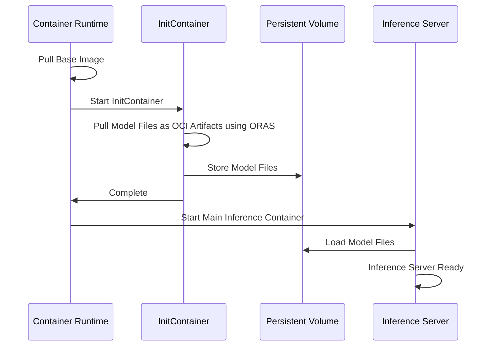

# Model As OCI Artifacts

The exponential growth and adoption of Large Language Models (LLMs) have revolutionized AI-driven applications across industries. However, distributing these models effectively remains a significant challenge. KAITO addresses this challenge by supporting the distribution of model files as OCI Artifacts, offering a scalable and efficient alternative to traditional containerized model distribution.

## Overview

Currently, KAITO employs a solution where the runtime library and model files are packaged within a single image. This method ensures a reliable and self-contained environment, particularly effective for distributing small models. However, as large language models grow, bundling them within containerized images becomes impractical.

Using Open Container Initiative (OCI) Artifacts offers a scalable and efficient alternative for packaging and deployment of large model files.

## Why OCI Artifacts?

### Image Building Challenges

Traditional containerized model distribution faces several challenges:

- **Build Time**: With KAITO hosting multiple models, base images are frequently updated due to vulnerability fixes and feature requests. Each time the base image is updated, every model image needs to be rebuilt.
- **Build Context Size**: Although model files remain unchanged, Docker image builds are time-consuming because large files are included in the build context unnecessarily.
- **Resource Intensive**: Building larger models like Falcon-40B can take nearly 2 hours to complete.

### Image Pulling Inefficiency

Image pulling is also time-consuming, even for smaller models:

- **Serial Processing**: All model files are packed into a single image layer, which limits download concurrency
- **Unpacking Bottleneck**: Container layer unpacking remains a serial process, creating performance bottlenecks
- **Limited Bandwidth Usage**: Current approach doesn't optimize bandwidth usage through concurrency

#### Container Pull Process Analysis

When containerd pulls an image, the operation consists of four phases:

1. **Downloading** layer data from the registry
2. **Decompressing** the layer if necessary  
3. **Checking** sha256 digest
4. **Unpacking** the layer, applying changes to the snapshot

Testing reveals that the download phase accounts for only 30% of the total time, highlighting the importance of optimizing the subsequent phases.

## Solution: OCI Artifacts

The Model As OCI Artifacts feature addresses these challenges through several optimizations:

### 1. Build Image Using ORAS Push

Instead of sending large model files to docker builder context, KAITO uses ORAS push to add model files to OCI layout assembly. This achieves the same result as Docker build but is much more efficient.

### 2. Improved Compression

Zstd compression is used instead of gzip, providing better decompression performance for large files like model weights.

### 3. Split Architecture

The containerized solution is split into two parts:

- **Base Image**: Contains the runtime and dependencies
- **OCI Artifacts**: Contains the model files

This allows model images to be built once and reused across base image updates.

## Architecture

### Model Files Download Process

The system uses an initContainer to download model files as OCI artifacts using ORAS:

### OCI Artifacts vs OCI Images

The Open Container Initiative (OCI) defines specifications and standards for container technologies, including the OCI Distribution Specification. OCI Image Manifests have a required field `config.mediaType` that differentiates between various types of artifacts.

- **OCI Image**: A subset of OCI artifacts, accepting only specific mediatypes
- **OCI Artifacts**: More general format that can contain various types of content including model files

ORAS (OCI Registry As Storage) is the tool used for managing OCI artifacts, including pushing, pulling, and handling metadata in OCI registries.

## Compatibility

### Container Runtimes

- **CRI-O**: Supports general OCI artifacts
- **Containerd**: Limited support for OCI artifacts (see [containerd issue](https://github.com/containerd/containerd/issues/11381#issuecomment-2917050414))

### OCI Registries

Most OCI registries support OCI artifacts. For a complete list of compatible registries, see the [ORAS compatibility documentation](https://oras.land/docs/compatible_oci_registries#registries-supporting-oci-artifacts).

## Benefits

### Performance Improvements

- **Reduced Build Time**: Model images only need to be built once
- **Faster Pulls**: Improved download concurrency and compression
- **Better Resource Usage**: Optimized bandwidth utilization

### Operational Benefits

- **Simplified Maintenance**: Base image updates don't require rebuilding all model images
- **Storage Efficiency**: Better compression ratios with zstd
- **Scalability**: More efficient handling of large model files

## Performance Results

Testing on Standard_NC24s_v3 with phi4 model shows significant improvements:

The evaluation compared different configurations:

| Configuration | Description | Benefits |
|---------------|-------------|----------|
| Baseline (single-layer-tar-gz) | Current approach with all files in one layer | Simple, self-contained |
| OCI Artifacts | Base image + separate model artifacts | Reduced build time, better performance |

## Getting Started

The Model As OCI Artifacts feature is automatically used for supported models when available. No additional configuration is required for basic usage.

For advanced configurations or troubleshooting, refer to the KAITO documentation and the [original proposal](https://github.com/kaito-project/kaito/blob/main/docs/proposals/20250609-model-as-oci-artifacts.md) for detailed technical specifications.

## Next Steps

- Monitor model download success rates and pod startup times
- Implement metrics for observability (`kaito_model_download_duration_seconds`, `kaito_model_download_failures_total`)
- Continue optimizing the download and unpacking process based on real-world usage patterns